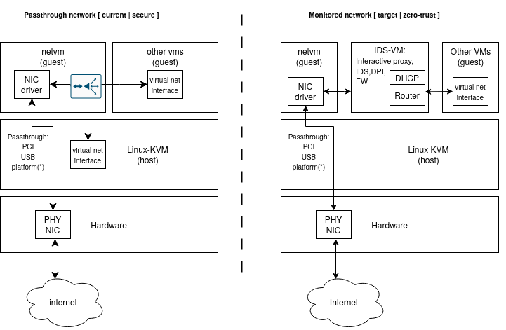

<!--
    Copyright 2023 TII (SSRC) and the Ghaf contributors
    SPDX-License-Identifier: CC-BY-SA-4.0
-->

# idsvm—Intrusion Detection System Virtual Machine

## Status

Proposed, partially implemented for development and testing.

*idsvm* reference declaration is available at [idsvm.nix](https://github.com/tiiuae/ghaf/blob/main/modules/virtualization/microvm/idsvm.nix).

## Context

Ghaf high-level design target is to secure a monolithic OS by modularizing the OS to networked VMs. As the *netvm* operates only as a front gateway to physical network interface, the purpose of the *idsvm* is to provide more advanced mechanisms to analyse Internet traffic and inter VM communication and to detect compromised application VMs and further limit network attack surface.

The following context diagram illustrates development and secure scenarios:

**Left**: A secure scenario. The network is passed through to *netvm* and routed to other parts of the system.
 
**Right**: A zero-trust scenario. The network is passed through to *netvm* and forwarded to *idsvm* where network is routed to other parts of the system.

## Decision

*idsvm* will provide:
- dynamic network configuration:
  - A DHCP server for *idsvm* to provide IP addresses for the other parts of the system, both static and dynamic.
  - Routing from *idsvm* to the Internet via *netvm* and/or inter VM.
- placeholder for advanced network traffic analysis mechanisms:
  - An interactive proxy for TLS protected data interception.
  - Intrusion Detection System.
  - Inter VM firewall policy deployment.

## Consequences

Adding separate guest VM to handle network communication analysis enables and simplifies deployment of zero trust policy engine and intrusion detection systems.

Adding one more networking related VM makes configuration and comprehension of the system still more difficult. It will also has inpact on networking performance.
