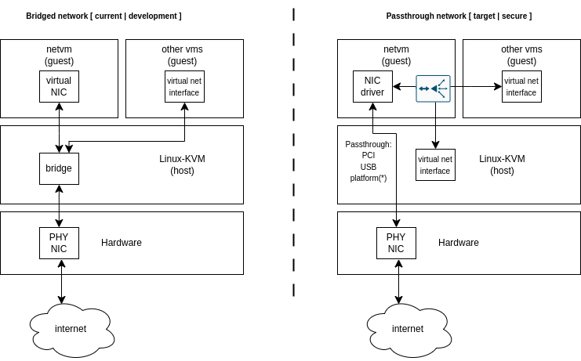

<!--
    Copyright 2022-2024 TII (SSRC) and the Ghaf contributors
    SPDX-License-Identifier: CC-BY-SA-4.0
-->

# netvm—Networking Virtual Machine

## Status

Proposed, partially implemented for development and testing.

*netvm* reference declaration is available at [netvm/default.nix](https://github.com/tiiuae/ghaf/blob/main/microvmConfigurations/netvm/default.nix).

## Context

Ghaf high-level design target is to secure a monolithic OS by modularizing the OS to networked VMs. The key security target is to not expose the trusted host directly to the Internet. This isolates the attack surface from the Internet to *netvm*.

The following context diagram illustrates development and secure scenarios:

**Left**: An insecure development scenario. The host is directly connected to the Internet, and the network is bridged from the host to other parts of the system.

**Right**: A secure scenario. The network is passed through to *netvm* and routed to other parts of the system.

## Decision

The development scenario simplifies the target system network access and configuration. This ADR proposes the development *netvm* configuration is maintained to support system development.

The secure scenario is proposed to be implemented with the use of passthrough to DMA and remap the host physical network interface card (PHY NIC) to *netvm*. This cannot be generalized for all hardware targets as it requires:
- Low-level device tree configuration for bootloader and host (at least on platform NIC).
- VMM host user space NIC bus mapping from the host to *netvm*.
- Native network interface driver (not virtual) in *netvm*. Native driver is bound the vendor BSP supported kernel version.

These depend on the hardware setup. The proposed target setup is that the passthrough network device(s) are implemented as declarative nix-modules for easier user hardware-specific configuration. In practice, a user may configure the declaration of a PCI or USB network card that is available to the available hardware setup.

*netvm* will provide:
- dynamic network configuration:
  - A DHCP server for *netvm* to provide IP addresses for the other parts of the system, both static and dynamic.
  - Routing from *netvm* to the Internet and/or inter VM.

For common reference hardware with platform NIC, the configured modules for network interface passthrough are provided. For more information, see [i.MX 8QM Ethernet Passthrough](https://tiiuae.github.io/ghaf/research/passthrough/ethernet.html).

Details of other network components, such as default firewall rules, DHCP (static and dynamic client addresses), routing, reverse proxies and security monitoring are to be described in their respective architecture decision records. In this context, these are illustrated in the context diagram on the right side of the *netvm* network interface driver. 

## Consequences

Isolating the attack surface from the host to networking-specific guest VM makes it easier to protect the critical host system from compromise. The isolation also makes it easier to deploy further security, such as a zero trust policy engine or intrusion detection system (IDS).

Isolation makes configuration and comprehension of the system more difficult.

