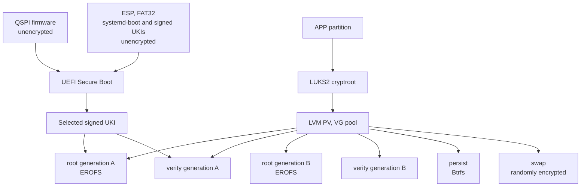
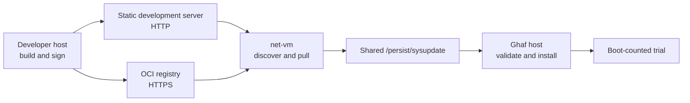
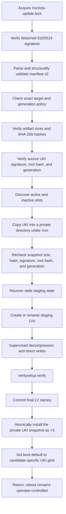

{/*
SPDX-FileCopyrightText: 2022-2026 TII (SSRC) and the Ghaf contributors
SPDX-License-Identifier: CC-BY-SA-4.0
*/}

# Secure A/B image updates

This document describes the shared signed A/B update architecture and its
NVIDIA Jetson Orin and x86 adapters. It covers the trust model, encrypted
storage layout, manifest contract, transactional installer, first-boot
provisioning, and health-gated rollback. Platform-specific build, deployment,
and acceptance procedures are carried by the NVIDIA Jetson Orin and x86
adapter changes.

:::caution[Development canaries]
The UEFI and update keys described here are development keys. They do not
represent NVIDIA fused BootROM trust or a production HSM-backed signing system.
NX on internal NVMe and AGX on internal eMMC are separate runtime targets; an
artifact accepted on one target is never evidence for the other.
:::

## Goals and invariants

The implementation maintains these invariants:

- APP is a LUKS2 container. Its decrypted payload is an LVM physical volume.
- Exactly one root/verity pair is active and the active pair is never modified.
- At most two complete root/verity pairs exist. Updates reuse the inactive pair.
- `/` and `/nix/store` remain immutable and dm-verity protected.
- `/persist` and swap are inside LUKS but are shared across system slots.
- A manifest binds the exact target, monotonic generation, artifact hashes,
  packed and unpacked sizes, and full dm-verity root hash.
- The UKI is independently signed and embeds the same root hash and generation.
- All authentication and policy checks complete before storage mutation.
- Installation stages data, verifies it, installs the UKI atomically, and
  changes boot selection last.
- Installing an update does not reboot the system.
- A trial receives three boot attempts and is blessed only after storage and
  configured core Ghaf MicroVMs are healthy.
- Failed trials roll back only the immutable system pair; `/persist` is not
  reverted.
- Downgrades are rejected unless a debug build explicitly enables and invokes
  the downgrade override.

## Storage and boot architecture

QSPI firmware and the EFI System Partition (ESP) remain unencrypted. APP uses
the following layering:



The root image contains the immutable Nix store. The UKI kernel command line
contains `ghaf.storehash=<64-hex-root-hash>` and
`ghaf.generation=<positive-integer>`. The initrd uses these values to select the
matching LVM pair and create the dm-verity mapping.

Logical-volume names encode the version and the first 16 hexadecimal digits of
the root hash:

```text
pool/root_<version>_<hash-fragment>
pool/verity_<version>_<hash-fragment>
```

During installation, temporary LVs use `root_staging_<hash-fragment>` and
`verity_staging_<hash-fragment>`. They are renamed only after both images have
been written and `veritysetup verify` succeeds. Runtime discovery also recovers
or removes incomplete staging state left by an interrupted installation.

## Trust model

### Development trust directory

One persistent local directory is shared by the NX and AGX canaries. Generate
it outside Git and outside any path copied to the Nix store:

```sh
umask 077
nix run .#ghaf-dev-keygen -- --output /secure/local/ghaf-dev-keys
```

`ghaf-dev-keygen` refuses to overwrite an existing trust set and creates:

| File | Purpose |
| --- | --- |
| `PK.key`, `PK.crt`, `PK.esl`, `PK.auth` | RSA-2048 UEFI Platform Key and enrollment payload |
| `KEK.key`, `KEK.crt`, `KEK.esl`, `KEK.auth` | RSA-2048 UEFI Key Exchange Key and enrollment payload |
| `db.key`, `db.crt`, `db.esl`, `db.auth` | RSA-2048 allowed-signature database, UKI signing, and enrollment payload |
| `update.key` | Ed25519 detached-manifest signing key |
| `update.pub` | Raw 32-byte Ed25519 verification key installed on the target |
| `recovery-passphrases/` | One mode-0600 printable LUKS recovery passphrase per flash |

Private keys must remain on the signing/flash host. The target receives only
`db.crt` and `update.pub`.

Record a non-secret public-trust inventory when the directory is created and
before every candidate build:

```sh
(
  cd "$GHAF_DEV_KEY_DIR"
  sha256sum PK.crt KEK.crt db.crt update.pub
  openssl x509 -in db.crt -noout -fingerprint -sha256 -dates -subject
)
```

Store the inventory with release evidence, not the private keys. The flash
script embeds the four file digests seen during impure evaluation. Before it
prepares any image, it requires the runtime `GHAF_DEV_KEY_DIR` to contain the
same public files and verifies that `db.key` matches `db.crt` and `update.key`
matches `update.pub`. A public-trust mismatch fails exactly with:

```text
ERROR: GHAF_DEV_KEY_DIR public trust does not match the trust embedded at image evaluation: <file>
  Rebuild the flash script with this exact GHAF_DEV_KEY_DIR.
```

A private/public mismatch identifies either `db.key/db.crt` or
`update.key/update.pub`. Never work around either error by mixing files from
two directories: rebuild with the intended complete directory.

Pure evaluation and CI builds do not require external settings. When
`GHAF_DEV_KEY_DIR` is unset, the canary uses repository development UEFI
certificates and the public RFC 8032 test-vector key. The corresponding update
private key is public knowledge, so this mode is for evaluation/build coverage
only. Evaluation prints exactly:

```text
<target>: GHAF_DEV_KEY_DIR is unset; using repository development public trust for evaluation/build only. Secure A/B deployment and update signing require GHAF_DEV_KEY_DIR from ghaf-dev-keygen.
```

When `--impure` exposes a complete external public trust set, evaluation uses
it and prints exactly:

```text
<target>: using external public trust from GHAF_DEV_KEY_DIR; private signing keys remain outside the Nix store.
```

If `GHAF_DEV_KEY_DIR` is set but a required public file is missing, evaluation
fails and lists the missing file names. Secure A/B flashing and update signing
always require the external private keys and fail before mutation if the
variable or any required file is absent.

The CI-only A/B image remains available for build coverage, but it must never
be deployed: its update verification key is public knowledge. To keep the
standard flash attribute useful in CI and development, the exported
`*-verity-luks-debug-*-flash-script` delegates to the same board's existing
generic unsigned target instead of invoking the secure A/B flash
implementation. It prints exactly:

```text
WARNING: secure A/B development trust was unavailable at evaluation; flashing the generic unsigned target instead.
  Requested: <secure-A/B-target>
  Fallback:  <generic-target>
  Rebuild with --impure and GHAF_DEV_KEY_DIR from ghaf-dev-keygen to flash the secure A/B canary.
```

The fallback is a different image and partitioning configuration; it does not
silently turn the CI-only A/B image into a deployable image. The wrapper strips
secure-image-only `--secure-boot`, `-u`/`--uki`, and
`-s`/`--signed-sd-image` arguments with explicit warnings so they cannot alter
the generic fallback. The internal secure A/B flash implementation retains its
original fail-closed check as defense in depth when invoked directly.

### Independent authentication layers

The update has two independent signatures:

1. A raw 64-byte detached Ed25519 signature authenticates the exact manifest
   bytes. Its default path is `<manifest>.sig`.
2. The UEFI `db` key signs the UKI. The updater verifies its Authenticode
   signature against the configured `db.crt`, and firmware verifies it during
   boot.

The manifest signature binds the payload metadata. The UKI signature prevents
an attacker from substituting boot code. The updater additionally extracts the
UKI command line and requires its root hash and generation to equal the signed
manifest values.

### LUKS keyslots

The flash process formats APP as LUKS2 with the temporary manufacturer key in
slot 0 and a newly generated recovery passphrase in slot 1. On first boot, the
OP-TEE device-unique-key flow replaces the manufacturer credential while
preserving the recovery slot. The recovery passphrase is printed during flash
and saved under `GHAF_DEV_KEY_DIR/recovery-passphrases/` without a trailing
newline.

Never put a recovery passphrase in Git, logs, issue trackers, or test reports.
Record only the recovery file name and whether recovery unlock passed.

### Development-key lifecycle

Treat one trust directory as an indivisible, named set. Back it up encrypted,
restrict it to release operators, record certificate expiry and public
fingerprints, and associate every recovery-passphrase filename with the board
and flash record without recording the passphrase itself. Keep an encrypted,
offline LUKS header backup for each flashed APP device; the header and recovery
passphrase are both sensitive recovery material.

There is no supported in-place trust rotation or revocation workflow in this
development canary. Losing a private signing key prevents new updates; losing
the only matching recovery material can make storage recovery impossible.
Creating a new trust directory requires rebuilding and destructively reflashing
the canary, then generating a new per-flash recovery passphrase. Do not overwrite
or partially replace files in an existing directory.

## Signed manifest v2

Build output contains compressed root and verity images, a UKI, and a manifest.
After signing, a payload directory has this shape:

```text
ghaf_<version>_<hash>.manifest
ghaf_<version>_<hash>.manifest.sig
ghaf_root_<version>_<hash>.raw.zst
ghaf_verity_<version>_<hash>.raw.zst
ghaf_kernel_<version>_<hash>.efi
```

The manifest schema is:

```json
{
  "manifest_version": 2,
  "system": "aarch64-linux",
  "build-system": "x86_64-linux",
  "target": "nvidia-jetson-orin-nx-verity-luks-debug",
  "generation": 8,
  "meta": {},
  "version": "26.08.1",
  "root_verity_hash": "<exactly 64 hexadecimal characters>",
  "root": {
    "file": "ghaf_root_<version>_<hash>.raw.zst",
    "sha256": "<64-hex SHA-256>",
    "packed_size": 2147483648,
    "unpacked_size": 6442450944
  },
  "verity": {
    "file": "ghaf_verity_<version>_<hash>.raw.zst",
    "sha256": "<64-hex SHA-256>",
    "packed_size": 67108864,
    "unpacked_size": 134217728
  },
  "kernel": {
    "file": "ghaf_kernel_<version>_<hash>.efi",
    "sha256": "<64-hex SHA-256>",
    "packed_size": 67108864,
    "unpacked_size": 67108864
  }
}
```

Artifact names must be basenames, not paths. All artifacts are resolved relative
to the manifest. `packed_size` describes the transferred file;
`unpacked_size` sizes and bounds the destination LV. Generation must be a
positive integer. `system` records the Nix target platform, while
`build-system` records whether the artifacts were built natively or by a cross
builder. These fields are inventory metadata; the target must exactly equal the
authorization target configured on the device.

Sign an unsigned build output without modifying its source directory:

```sh
nix run .#ghaf-sign-update -- \
  --key-dir "$GHAF_DEV_KEY_DIR" \
  --input result-update/ghaf_<version>_<hash>.manifest \
  --output signed-update
```

The signer copies the payload, recomputes root and verity metadata, signs the
UKI with `db.key`, recomputes its metadata, and finally signs the exact manifest
with `update.key`.

## Publishing and fetching updates

There are two development delivery paths:

- a static HTTP server on the developer machine for a manual, isolated-lab
  round trip; and
- an OCI Distribution-compatible HTTPS registry for authenticated repository,
  discovery, and credential testing.

In both paths, `net-vm` owns the network connection and writes into the host's
shared `/persist/sysupdate` directory. The Ghaf host—not `net-vm`—performs the
trusted validation and storage installation. Transport success is never
authorization to install.



| Capability | Current canary | Operator or future policy |
| --- | --- | --- |
| Build and sign | Developer host | Manual, external private keys |
| Static HTTP fetch | `net-vm` | Manual, isolated development only |
| OCI discover and pull | `net-vm` | Manual command with provisioned credential |
| Host validation and install | Ghaf host | Manual, privileged command |
| Reboot into trial | Ghaf host | Manual operator decision |
| Health blessing or rollback | Ghaf host | Automatic after a trial boots |
| Scheduled discovery/download | Not configured | Requires a timer, backoff, capacity policy, and credential provisioning |
| Approval and unattended install/reboot | Not configured | Requires fleet policy, maintenance windows, audit logging, and recovery ownership |

Do not describe manual device-initiated pull as unattended updating. Automation
must preserve the network/trusted-host boundary, serialize installation with the
existing lock, require a completely published bundle, and define who approves
download, install, and reboot separately.

### Static development HTTP server

Use this path to test an NX or AGX on the same controlled development network
without setting up an OCI registry. Plain HTTP has no server authentication,
confidentiality, repository policy, or rollback protection. The detached
manifest signature, artifact hashes, exact target, accepted generation, UKI
signature, and embedded root hash still protect installation, but an attacker
can observe traffic, deny service, or substitute data that validation will
reject. Never use this path as a production update service.

The secure canary `net-vm` contains `curl` and `jq` for this procedure. The
Ghaf host intentionally has no direct external fetch step.

#### Prepare a public server directory

Start with an already signed NX or AGX payload. Open a developer shell with the
server tools if the machine does not provide them:

```sh
nix shell nixpkgs#python3 nixpkgs#jq nixpkgs#curl
```

Create a new directory containing only the five public payload files. Do not
serve the build tree, trust directory, recovery passphrases, or private keys:

```sh
SIGNED_DIR="signed-nx-generation-$GHAF_UPDATE_GENERATION"
SIGNED_MANIFEST="$(find "$SIGNED_DIR" -maxdepth 1 -name '*.manifest' -print -quit)"
test -s "$SIGNED_MANIFEST"
test -s "$SIGNED_MANIFEST.sig"

HTTP_ROOT="$(mktemp -d)"
install -m 0644 "$SIGNED_MANIFEST" "$HTTP_ROOT/manifest.json"
install -m 0644 "$SIGNED_MANIFEST.sig" "$HTTP_ROOT/manifest.json.sig"

for kind in root verity kernel; do
  artifact="$(jq -er --arg kind "$kind" '.[$kind].file' "$SIGNED_MANIFEST")"
  case "$artifact" in
    "" | .* | *[!A-Za-z0-9._-]*)
      echo "Unsafe $kind artifact name: $artifact" >&2
      exit 1
      ;;
  esac
  test -s "$SIGNED_DIR/$artifact"
  install -m 0644 "$SIGNED_DIR/$artifact" "$HTTP_ROOT/$artifact"
done

test "$(find "$HTTP_ROOT" -mindepth 1 -maxdepth 1 -type f | wc -l)" -eq 5
find "$HTTP_ROOT" -mindepth 1 -maxdepth 1 -type f -printf '%f\n' | sort
```

The manifest is copied byte-for-byte to the stable HTTP name `manifest.json`;
renaming it does not invalidate its detached signature. The three artifact
names remain exactly those signed into the manifest.

#### Bind and test the server

Choose an unused non-privileged port and an address on the developer interface
reachable from the Orin physical network. Do not bind only to loopback. Keep
the advertised origin out of Git and test reports:

```sh
export UPDATE_HTTP_BIND='<developer-interface-address>'
export UPDATE_HTTP_PORT='<non-privileged-port>'
export UPDATE_HTTP_ORIGIN="http://${UPDATE_HTTP_BIND}:${UPDATE_HTTP_PORT}"

python3 -m http.server \
  --bind "$UPDATE_HTTP_BIND" \
  --directory "$HTTP_ROOT" \
  "$UPDATE_HTTP_PORT"
```

Leave that command in its own terminal. If the developer firewall blocks the
port, add a temporary inbound TCP rule scoped to the development interface and
the target network only. Do not open the server to an untrusted network.

From a second developer terminal, confirm that HTTP returns the exact signed
manifest:

```sh
curl --fail --silent --show-error \
  "$UPDATE_HTTP_ORIGIN/manifest.json" \
  | cmp - "$HTTP_ROOT/manifest.json"
```

#### Fetch from the device's `net-vm`

Open the debug console or an authenticated administrative session to
`net-vm`. Set the origin to the developer server and choose a new generation.
`ghaf-fetch-update` rejects path-like manifest names and publishes the bundle
only after every download succeeds:

```sh
export UPDATE_HTTP_ORIGIN='http://<developer-interface-address>:<port>'
export GHAF_UPDATE_GENERATION='<candidate-generation>'
ghaf-fetch-update "$UPDATE_HTTP_ORIGIN" "$GHAF_UPDATE_GENERATION"
```

If a transfer fails, do not create `fetch.complete`. Retain the hidden temporary
directory as failure evidence or delete that exact directory after inspecting
it; the next attempt must create a new temporary directory. Never retry inside
an old published directory, because it may contain a stale completion marker or
artifacts from a different manifest. The final same-filesystem rename publishes
all five files and the marker together. A successful HTTP status does not
authenticate any file.

#### Validate and install on the Ghaf host

Return to the Ghaf host. The shared directory is the same path there. Require
the completion marker, then run all three updater phases explicitly:

```sh
PULLED_MANIFEST="/persist/sysupdate/http-generation-<candidate-generation>/manifest.json"
test -f "$(dirname "$PULLED_MANIFEST")/fetch.complete"
test -s "$PULLED_MANIFEST"
test -s "$PULLED_MANIFEST.sig"

sudo ota-update image validate --manifest "$PULLED_MANIFEST"
sudo ota-update image --dry-run install --manifest "$PULLED_MANIFEST"
sudo ota-update image install --manifest "$PULLED_MANIFEST"
```

Validation must complete before any LVM or ESP mutation. Installation must
report that a reboot is required and must not reboot automatically. Reboot
under operator control and observe the normal three-attempt health-gated trial.

For AGX, use a signed AGX directory and the exact AGX manifest target; the HTTP
server and `net-vm` steps are otherwise identical. Storage installation then
targets the AGX eMMC inactive pair rather than the NX NVMe inactive pair.

#### Negative tests and cleanup

Before accepting this transport path, exercise these cases:

- stop the server during each of the five downloads: no completion marker is
  written and no host installation is attempted;
- alter the fetched manifest, signature, UKI, root image, or verity image: host
  validation fails before mutation;
- offer a correctly signed payload for the other Orin target: exact-target
  policy rejects it;
- offer an accepted or older generation: generation policy rejects it; and
- fetch successfully but omit `fetch.complete`: the documented operator
  procedure stops before validation/install.

After the run, stop the server, remove the temporary firewall rule, and either
retain the public server directory with the test evidence or delete that exact
temporary directory after checking its contents. Never record the developer
address, credentials, private keys, or recovery passphrase in committed
documentation.

The registry artifact contains the exact signed manifest as its OCI config and
four required layers:

- detached Ed25519 signature,
- signed UKI,
- compressed root image, and
- compressed verity image.

An optional changelog can be a fifth layer. Pull preserves the manifest bytes
and writes the signature as `manifest.json.sig`, allowing the normal
`ota-update image validate` command to authenticate the downloaded bundle.

### Registry setup

The registry must support the OCI Distribution API over HTTPS. Create a
repository for the NX canary and issue separate credentials:

- a short-lived or CI-scoped write credential for the developer host, and
- a read-only credential for `net-vm`.

Use role-based variables rather than embedding an endpoint or credential in the
source tree:

```sh
export REGISTRY_ENDPOINT='<registry-dns-name>'
export UPDATE_REPOSITORY_PATH='<namespace>/ghaf-orin-nx'
export UPDATE_TAG="generation-$GHAF_UPDATE_GENERATION"
export UPDATE_REF="${REGISTRY_ENDPOINT}/${UPDATE_REPOSITORY_PATH}:${UPDATE_TAG}"
read -rsp 'Registry token: ' REGISTRY_TOKEN
export REGISTRY_TOKEN
```

Omit `--token` for a deliberately anonymous repository. Basic authentication is
also available through `--username` and `--password`. Do not use `--insecure`
outside an isolated throwaway test registry.

#### Disposable local HTTPS registry

Use this procedure when no registry service is available. It follows the
[CNCF Distribution deployment model](https://distribution.github.io/distribution/about/deploying/)
with TLS and bcrypt `htpasswd` authentication. The registry is disposable and
has no repository-level authorization: its one short-lived credential can both
push and pull, so it does not demonstrate production read-only policy.

Choose a lab DNS name that resolves to the developer interface from both the
developer host and `net-vm`. Keep its address out of committed files:

```sh
export CONTAINER_ENGINE=podman # use docker if that is the approved engine
export REGISTRY_DNS='<registry-dns-name>'
export REGISTRY_BIND='<developer-interface-address>'
export REGISTRY_PORT='<non-privileged-port>'
export REGISTRY_ENDPOINT="${REGISTRY_DNS}:${REGISTRY_PORT}"
export REGISTRY_ROOT="$(mktemp -d)"
install -d -m 0700 \
  "$REGISTRY_ROOT/auth" "$REGISTRY_ROOT/certs" "$REGISTRY_ROOT/data"
```

Create a two-day development CA and a server certificate with the DNS name in
its subject alternative name:

```sh
openssl req -x509 -newkey rsa:3072 -nodes -days 2 -sha256 \
  -subj '/CN=Ghaf disposable registry CA/' \
  -keyout "$REGISTRY_ROOT/certs/ca.key" \
  -out "$REGISTRY_ROOT/certs/ca.crt"
openssl req -new -newkey rsa:3072 -nodes -sha256 \
  -subj "/CN=$REGISTRY_DNS/" \
  -keyout "$REGISTRY_ROOT/certs/server.key" \
  -out "$REGISTRY_ROOT/certs/server.csr"
printf 'subjectAltName=DNS:%s\nextendedKeyUsage=serverAuth\n' "$REGISTRY_DNS" \
  > "$REGISTRY_ROOT/certs/server.ext"
openssl x509 -req -days 2 -sha256 \
  -in "$REGISTRY_ROOT/certs/server.csr" \
  -CA "$REGISTRY_ROOT/certs/ca.crt" \
  -CAkey "$REGISTRY_ROOT/certs/ca.key" -CAcreateserial \
  -extfile "$REGISTRY_ROOT/certs/server.ext" \
  -out "$REGISTRY_ROOT/certs/server.crt"
```

Create one random test password without placing it in shell history or the
`htpasswd` command line, then start Distribution Registry 3:

```sh
export REGISTRY_USER=ghaf-update-test
read -rsp 'Disposable registry password: ' REGISTRY_PASSWORD
printf '\n'
export REGISTRY_PASSWORD
printf '%s\n' "$REGISTRY_PASSWORD" \
  | "$CONTAINER_ENGINE" run --rm -i --entrypoint htpasswd \
      docker.io/library/httpd:2 -Bni "$REGISTRY_USER" \
  > "$REGISTRY_ROOT/auth/htpasswd"

"$CONTAINER_ENGINE" run -d --name ghaf-update-registry \
  --publish "${REGISTRY_BIND}:${REGISTRY_PORT}:5000" \
  --volume "$REGISTRY_ROOT/data:/var/lib/registry:Z" \
  --volume "$REGISTRY_ROOT/certs:/certs:Z,ro" \
  --volume "$REGISTRY_ROOT/auth:/auth:Z,ro" \
  --env REGISTRY_HTTP_TLS_CERTIFICATE=/certs/server.crt \
  --env REGISTRY_HTTP_TLS_KEY=/certs/server.key \
  --env REGISTRY_AUTH=htpasswd \
  --env 'REGISTRY_AUTH_HTPASSWD_REALM=Ghaf development registry' \
  --env REGISTRY_AUTH_HTPASSWD_PATH=/auth/htpasswd \
  docker.io/library/registry:3

curl --fail --silent --show-error \
  --cacert "$REGISTRY_ROOT/certs/ca.crt" \
  --user "$REGISTRY_USER:$REGISTRY_PASSWORD" \
  "https://${REGISTRY_ENDPOINT}/v2/"
```

For developer-host `ota-update` commands, set
`SSL_CERT_FILE="$REGISTRY_ROOT/certs/ca.crt"` and replace `--token` with
`--username "$REGISTRY_USER" --password "$REGISTRY_PASSWORD"`. Transfer only
`ca.crt` to `net-vm` through the authenticated administrative channel, compare
its SHA-256 with the developer-host value, and set `SSL_CERT_FILE` to that copy
before discover or pull. Never fetch the CA from the registry it is meant to
authenticate. The password is visible in the current CLI process arguments;
use only this short-lived disposable credential on a controlled test system.

After the host and device round trips, save only artifact digests and results,
then stop the container and delete the exact temporary root after verifying its
path:

```sh
"$CONTAINER_ENGINE" rm -f ghaf-update-registry
test -n "$REGISTRY_ROOT" && test "$REGISTRY_ROOT" != / && rm -rf -- "$REGISTRY_ROOT"
unset REGISTRY_PASSWORD SSL_CERT_FILE
```

### Publish from the developer host

After building and signing the candidate, locate the signed manifest and push
the complete bundle:

```sh
SIGNED_DIR="signed-nx-generation-$GHAF_UPDATE_GENERATION"
SIGNED_MANIFEST="$(find "$SIGNED_DIR" -maxdepth 1 -name '*.manifest' -print -quit)"
test -n "$SIGNED_MANIFEST"
test -s "$SIGNED_MANIFEST.sig"

nix run .#ghaf-ota-update -- \
  registry --token "$REGISTRY_TOKEN" push \
  --manifest "$SIGNED_MANIFEST" \
  "$UPDATE_REF"
```

The push fails if any manifest artifact or detached signature is absent. Record
the returned OCI manifest digest with the test evidence.

### Test a round-trip fetch on the developer host

Pull into a temporary directory before offering the update to hardware:

```sh
PULL_ROOT="$(mktemp -d)"
nix run .#ghaf-ota-update -- \
  registry --token "$REGISTRY_TOKEN" pull --validate \
  --destination "$PULL_ROOT" \
  "$UPDATE_REF"

PULLED_MANIFEST="$PULL_ROOT/$UPDATE_REPOSITORY_PATH/$UPDATE_TAG/manifest.json"
test -s "$PULLED_MANIFEST"
test -s "$PULLED_MANIFEST.sig"
cmp "$SIGNED_MANIFEST" "$PULLED_MANIFEST"
cmp "$SIGNED_MANIFEST.sig" "$PULLED_MANIFEST.sig"
```

`registry pull --validate` checks OCI blob digests plus manifest artifact sizes
and hashes. It does not replace the signed image-policy validation. Authenticate
the round-tripped bundle separately:

```sh
nix run .#ghaf-ota-update -- image validate \
  --manifest "$PULLED_MANIFEST" \
  --trusted-key "$GHAF_DEV_KEY_DIR/update.pub" \
  --uki-trusted-cert "$GHAF_DEV_KEY_DIR/db.crt" \
  --target nvidia-jetson-orin-nx-verity-luks-debug \
  --accepted-generation-file "$PULL_ROOT/accepted-generation"
```

An absent accepted-generation file means no generation has yet been accepted in
this isolated transport test.

### Fetch on the NX through `net-vm`

The Ghaf host intentionally does not need a direct external network path.
`net-vm` includes `ota-update` and mounts the host's `/persist/sysupdate` through
virtiofs. From a `net-vm` console or authenticated administrative session:

```sh
export REGISTRY_ENDPOINT='<registry-dns-name>'
export UPDATE_REPOSITORY_PATH='<namespace>/ghaf-orin-nx'
export UPDATE_TAG='<approved-tag>'
export UPDATE_REF="${REGISTRY_ENDPOINT}/${UPDATE_REPOSITORY_PATH}:${UPDATE_TAG}"
read -rsp 'Read-only registry token: ' REGISTRY_TOKEN
export REGISTRY_TOKEN

ota-update registry --token "$REGISTRY_TOKEN" discover \
  "${REGISTRY_ENDPOINT}/${UPDATE_REPOSITORY_PATH}"

ota-update registry --token "$REGISTRY_TOKEN" pull --validate \
  --destination /persist/sysupdate \
  "$UPDATE_REF"
```

Do not pass `--install` to `registry pull`. Network retrieval belongs to
`net-vm`; target policy validation and LVM/ESP mutation belong to the host. The
pull result is visible on the host at:

```text
/persist/sysupdate/<namespace>/ghaf-orin-nx/<approved-tag>/manifest.json
/persist/sysupdate/<namespace>/ghaf-orin-nx/<approved-tag>/manifest.json.sig
```

On the Ghaf host, validate, preview, and install the fetched payload:

```sh
PULLED_MANIFEST='/persist/sysupdate/<namespace>/ghaf-orin-nx/<approved-tag>/manifest.json'

sudo ota-update image validate --manifest "$PULLED_MANIFEST"
sudo ota-update image --dry-run install --manifest "$PULLED_MANIFEST"
sudo ota-update image install --manifest "$PULLED_MANIFEST"
```

Confirm that installation reports a reboot requirement without rebooting, then
reboot under operator control and observe the health-gated trial.

This is device-initiated fetching because the pull executes on the NX's
network-owning VM. The current canary does not schedule registry discovery or
installation automatically; adding a timer and securely provisioned read token
is a separate fleet-policy decision.

## Installer validation and transaction

The target configuration provides these defaults:

```text
GHAF_UPDATE_TRUSTED_KEY=/etc/ghaf/update/update.pub
GHAF_UKI_TRUSTED_CERT=/etc/ghaf/update/db.crt
GHAF_UPDATE_TARGET=<exact canary target>
GHAF_ACCEPTED_GENERATION_FILE=/persist/common/ota/accepted-generation
```

NixOS writes these values through `environment.sessionVariables`, and the
configured `sudo` PAM service imports the system environment. The short
`sudo ota-update ...` examples therefore work on a normally booted canary. In a
rescue shell, chroot, or any context that does not use that PAM path, pass every
trust input explicitly:

```sh
sudo ota-update image install \
  --manifest "$PULLED_MANIFEST" \
  --signature "$PULLED_MANIFEST.sig" \
  --trusted-key /etc/ghaf/update/update.pub \
  --uki-trusted-cert /etc/ghaf/update/db.crt \
  --target '<exact-canary-target>' \
  --accepted-generation-file /persist/common/ota/accepted-generation
```

Before downloading or installing, check the shared download area, ESP, and VG:

```sh
df -h /persist /boot
find /persist/sysupdate -mindepth 1 -maxdepth 2 -type f -printf '%s %p\n' | sort -n
find /boot/EFI/Linux -maxdepth 1 -type f -printf '%s %f\n' | sort -n
sudo vgs --units b --nosuffix -o vg_name,vg_size,vg_free pool
sudo lvs --units b --nosuffix -o lv_name,lv_size pool
jq '{generation, root: .root.unpacked_size, verity: .verity.unpacked_size, kernel: .kernel.packed_size}' "$PULLED_MANIFEST"
```

Run the dry-run plan before mutation. A candidate larger than the inactive LVs
requires sufficient VG free space for their resize; insufficient space fails
before writes and never permits shrinking or overwriting the active pair. Keep
room on the ESP for the temporary UKI plus the two managed entries. Prune OCI
downloads with `ota-update registry prune --destination /persist/sysupdate`;
inspect and remove only explicitly identified hidden HTTP temporary directories.
Never delete the active UKI, active LVs, accepted-generation file, or an
unexamined staging LV to make space.

`ota-update image install` performs the following sequence:



The lock is acquired before runtime discovery, preventing two installers from
choosing the same inactive slot from stale state. Decompression and writing are
separately supervised processes, so a decompressor failure cannot be hidden by
a successful downstream writer.

The UKI snapshot closes the validation-to-copy race on the `net-vm`-writable
shared directory. Root and verity data remain safe against a post-validation
source change because the newly written pair must reproduce the signed full
verity root hash before either LV name or boot state is committed.

Validation can be run without mutation:

```sh
ota-update image validate \
  --manifest /persist/sysupdate/ghaf_<version>_<hash>.manifest
```

Preview the complete mutation plan:

```sh
ota-update image --dry-run install \
  --manifest /persist/sysupdate/ghaf_<version>_<hash>.manifest
```

Install after validation:

```sh
sudo ota-update image install \
  --manifest /persist/sysupdate/ghaf_<version>_<hash>.manifest
```

The command reports that a reboot is required but never reboots automatically.
Use `ota-update image status` to inspect discovered UKIs and LVs. Removal is
restricted to a non-active slot:

```sh
sudo ota-update image remove --version <version> --hash <hash-fragment>
```

`--allow-downgrade` is compiled only with the `debug-downgrade` feature. It must
not be enabled in production packages.

## Boot counting, health, and rollback

The new UKI is installed with systemd-boot's three-attempt suffix, for example:

```text
/boot/EFI/Linux/ghaf-26.08.1-0123456789abcdef+3.efi
```

Trial activation deliberately sets the persistent default to a
candidate-specific glob:

```sh
bootctl set-default 'ghaf-<version>-<hash>*.efi'
```

Do not replace this with either an exact trial default or the broad
`ghaf-*.efi` namespace. An exact `LoaderEntryDefault` can continue selecting an
exhausted `+0-3` entry. A broad glob can select an older entry when two updates
share the same OS version and their hash fragments sort differently. The
candidate-specific wildcard selects the intended counted trial while allowing
systemd-boot to fall back after its attempts are exhausted. Only a healthy
generation is promoted to an exact persistent default.

`ghaf-boot-health.service` runs after LUKS, `/persist`, `microvms.target`, and
the configured core MicroVM services. It requires:

- the configured LUKS mapper to be active,
- the configured dm-verity mapper to be active,
- `/nix/store` and `/persist` to be mounted,
- every configured core Ghaf MicroVM service to be active, and
- a valid `ghaf.generation` on the kernel command line.

AppVM readiness and interactive login are intentionally not blessing gates.

For a healthy new generation, the service calls `systemd-bless-boot good`, sets
the exact current UKI as the persistent default, and atomically advances
`/persist/common/ota/accepted-generation`. A healthy fallback with a lower
generation is allowed to run but does not lower the accepted generation.

If a counted trial is unhealthy, the service re-arms the same entry while tries
remain and requests a reboot. After the final failed attempt it leaves the
managed glob in place; the next boot selects the blessed fallback. Initrd and
stage-2 watchdogs, `boot.panic_on_fail`, and `panic=10` allow early verity
failures to consume attempts on Orin.

## First-boot provisioning

The flash image contains only the initial root/verity pair. First boot is
idempotent and performs these operations in dependency order:

1. Retrieve the temporary disk key through the OP-TEE DUK path.
2. Unlock APP as `/dev/mapper/cryptroot`.
3. Preserve recovery slot 1 while rotating the manufacturer credential.
4. Expand the physical APP partition to the available storage boundary.
5. Resize the open LUKS mapping while the key remains in the initrd keyring.
6. Resize the LVM PV.
7. Create the randomly encrypted 4096 MiB swap LV.
8. Create and format the Btrfs persist LV.
9. Leave 1.5 times the initial root-plus-verity size, plus 64 MiB, free for the
   second system pair.

The first-boot services may be rerun after interruption. Existing swap and
persist LVs are detected and retained. More precisely:

- APP partition, open-LUKS, and PV resize operations are idempotent; rerun only
  after confirming `cryptroot` is open on the intended APP partition;
- an existing swap LV is retained and the ordered NixOS swap service completes
  its initialization;
- an existing blank persist LV is formatted as Btrfs on the next run;
- an existing Btrfs persist LV is never reformatted; and
- any other detected filesystem on the persist LV stops first boot with an
  exact error and requires investigation, not `mkfs --force`.

Do not attempt OTA conversion of an unencrypted APP partition, a raw root
filesystem, a VG without the managed root/verity naming model, or any layout
that cannot identify exactly one active immutable pair. Wrapping an existing
installation in LUKS2 and establishing the initial trust/ESP/LVM layout require
a destructive canary reflash. A legacy slot name is migratable only when it is
already inside the expected unlocked VG and runtime discovery identifies it
unambiguously.

## Canary configurations and build workflow

The NVIDIA configurations are:

| Configuration | Runtime storage | Coverage policy |
| --- | --- | --- |
| `nvidia-jetson-orin-nx-verity-luks-debug` | internal NVMe | build and hardware acceptance |
| `nvidia-jetson-orin-agx-verity-luks-debug` | internal eMMC | build and hardware acceptance |

The AGX canary disables the optional OP-TEE-backed firmware TPM. Hardware
testing found that its `tpm_ftpm_tee` probe can remain in uninterruptible sleep
and prevent reboot. This does not disable the independent OP-TEE
device-unique-key service used to unlock APP. The NX canary retains fTPM and EK
provisioning.

Set a new positive generation for every candidate. Heavy Nix commands must run
sequentially and use a wall-clock timeout:

```sh
export GHAF_DEV_KEY_DIR=/secure/local/ghaf-dev-keys
export GHAF_UPDATE_GENERATION=8

timeout 2h nix build --impure \
  .#nvidia-jetson-orin-nx-verity-luks-debug-from-x86_64-ghafImage \
  -o result-nx-update

timeout 2h nix build --impure \
  .#nvidia-jetson-orin-agx-verity-luks-debug-from-x86_64-ghafImage \
  -o result-agx-update
```

Build the NX flash entry point separately:

```sh
timeout 2h nix build --impure \
  .#nvidia-jetson-orin-nx-verity-luks-debug-from-x86_64-flash-script \
  -o result-nx-flash
```

The x86 adapter publishes initial disk and update-payload targets separately:

```sh
timeout 2h nix build --impure .#intel-laptop-debug-secure-ab -o result-x86-initial
timeout 2h nix build --impure .#intel-laptop-debug-secure-ab-sysupdate -o result-x86-update
```

The initial artifact already contains an encrypted LVM A/B layout, dm-verity
A slot, persistent and swap volumes, and an unsigned Type-2-only ESP. Sign its
ESP outside Nix with `ghaf-sign-x86-image`; sign update payloads with the same
platform-independent `ghaf-sign-update` command used for Orin.

:::danger[Evaluation resource bound]
Do not run two heavy evaluations of this flake concurrently. Wrap every large
evaluation or build in `timeout 2h`.
:::

## Source ownership map

| Concern | Ghaf source |
| --- | --- |
| Shared trust selection and updater environment | `modules/partitioning/secure-update.nix` |
| NVIDIA targets, flash adapter, watchdogs | `targets/nvidia-jetson-orin/flake-module.nix` |
| x86 targets and package split | `targets/laptop/flake-module.nix` |
| Root/verity/UKI/manifest build | `modules/partitioning/verity-volume.nix` |
| Shared initial verity LVM A slot | `modules/partitioning/initial-verity-lvm.nix` |
| x86 GPT/LUKS/LVM/ESP bootstrap | `modules/partitioning/initial-verity-disk-x86.nix` |
| Manifest generation | `modules/partitioning/mk-manifest.py` |
| Flash ESP, LUKS, recovery key | `modules/reference/hardware/jetpack/nvidia-jetson-orin/partition-template-verity.nix` |
| NVIDIA ESP and flash-image adapter | `modules/reference/hardware/jetpack/nvidia-jetson-orin/verity-image.nix` |
| DUK, APP and LUKS resize | `modules/reference/hardware/jetpack/nvidia-jetson-orin/jetson-orin.nix` |
| Persist, swap, B-slot reservation | `modules/partitioning/firstboot-persist.nix` |
| Health gate and blessing | `modules/partitioning/boot-health.nix` |
| Development key generator | `packages/pkgs-by-name/ghaf-dev-keygen/` |
| Update signer | `packages/pkgs-by-name/ghaf-sign-update/` |
| x86 initial-image signer | `packages/pkgs-by-name/ghaf-sign-x86-image/` |

The installer lives in the `ghaf-givc` repository:

| Concern | ghaf-givc source |
| --- | --- |
| CLI and trust arguments | `crates/ota-update/src/image/cli.rs` |
| Manifest schema and policy | `crates/ota-update/src/image/manifest.rs` |
| Pre-mutation validation | `crates/ota-update/src/image/install.rs` |
| Slot discovery and staging recovery | `crates/ota-update/src/image/runtime.rs` |
| Transaction construction | `crates/ota-update/src/image/plan.rs` |
| Supervised writes | `crates/ota-update/src/image/executor.rs` |
| Ed25519 verification | `crates/ota-update/src/image/signature.rs` |
| UKI discovery and naming | `crates/ota-update/src/image/uki.rs` |
| OCI publish, fetch, and signature transport | `crates/ota-update/src/registry/` |
| Privileged OVMF integration test | `nixos/tests/ota-update-image.nix` |

## Security boundaries and non-goals

- Rollback changes the immutable system pair only. It does not snapshot or
  restore `/persist`.
- QSPI and ESP confidentiality is not provided; integrity comes from the UEFI
  trust chain and signed UKIs.
- Development keys are not production key management.
- The implementation does not claim NVIDIA fused Secure Boot.
- AGX runtime behavior is not accepted from NX results, or conversely.
- An unsigned UKI being rejected is necessary, but firmware falling through to
  network boot is not proof that a signed fallback was selected.
- Automatic recovery from a hard hang is not accepted on a board until that
  board's physical watchdog/reset path is demonstrated.
- Release readiness requires repeated signed updates, corruption rollback,
  recovery-key testing, power interruption at every transaction phase, and
  automatic health rollback on every promoted hardware target.
