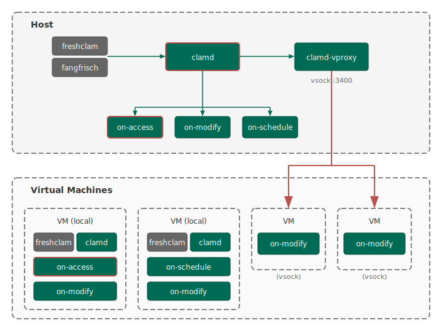

This module provides antivirus scanning capabilities for Ghaf systems, supporting both centralized host-based scanning and distributed guest-based configurations.
Note that we do not make any claims regarding scanning detection and accuracy - this fully relies on upstream ClamAV.

## Architecture

The ClamAV module is flexible and can be deployed in different configurations in guests or host. Scanning can occur locally or be delegated to a remote daemon via vsock. This allows resource-constrained guests to offload scanning to the host (or another guest) while maintaining security isolation. In any offload cases,
the scanning instance is implicitly trusted, and scanning is performed on a best effort basis.

This design is necessary for edge devices to maintain isolation but allow offloaded malware scanning to avoid the major performance impact running a local daemon incurs.

> **Note:** Enabling particular components requires consideration of the envisioned isolation boundaries, file system layout, permissions, mount points and namespaces, notification setup, memory constraints, and more. Aside from necessary assertions, the module itself does not provide any analysis or evaluation.

---

## Components

### Daemon (clamd)

The ClamAV daemon provides high-performance scanning by keeping virus signatures loaded in memory. It accepts scan requests via Unix socket or, when combined with the vsock proxy, from guest VMs.

| Property | Description |
| ---------- | ------------- |
| Activation | Path-activated; starts when database becomes available |
| Memory | ~500MB-1000MB when loaded with signatures |
| Socket | `/run/clamav/clamd.sock` |

### Database Updater (freshclam)

Downloads and maintains the official ClamAV virus signature database. Waits for network availability before attempting downloads.

| Property | Description |
| ---------- | ------------- |
| Database path | `/var/lib/clamav/` |
| Storage required | ~500MB |
| Default interval | Hourly |

### Fangfrisch

Optional third-party signature manager that supplements the official database with community-maintained signatures. Runs independently from freshclam.

### Vsock Proxy (clamd-vproxy)

Bridge service exposing the local clamd daemon to guest VMs via virtio-vsock. It could technically run in another guest via vsock host proxy forwarding, however, this functionality has not been tested.

| Property | Description |
| ---------- | ------------- |
| Default CID | 2 (host) |
| Default port | 3400 |
| Protocol | ClamAV native over vsock |

---

## Scan Modes

Scan modes are grouped into on-access, on-modify, and on-schedule to reflect their nature. Each mode uses different tools, where some modes may be configured in multiple ways depending on the scanning architecture.

### On-Access

> Kernel-level scanning via fanotify using clamonacc

This mode uses the clamonacc binary of ClamAV. It uses Linux fanotify to intercept file access at the kernel level. When a file is opened, execution blocks until the scan completes. Beware of mountpoints and namespaces when using this mode - refer to the official documentation for setup and constraints.

| Aspect | Detail |
| -------- | -------- |
| Security | High - blocks access to infected files |
| Performance | May impact I/O on high-throughput directories |
| Requirement | Local daemon only |

**Host:** Monitors configured directories, blocking access before files can be read or executed.

**Guest:** Not supported without local daemon. Guests requiring on-access protection must run their own clamd instance.

---

### On-Modify

> Lightweight scanning via inotify

Monitors directories using inotify and triggers scans when files are created, moved, or modified. Does not block file operations - files are scanned after write completion.

| Aspect | Detail |
| -------- | -------- |
| Security | Good - scans after write completion |
| Performance | Minimal impact |
| Requirement | Local daemon OR remote via vsock |

**Host with daemon:** Scans performed locally via clamd socket.

**Guest with daemon:** Same as host - local scanning via clamd.

**Guest without daemon:** Files sent to host's clamd-vproxy via vsock. Recommended for resource-constrained guests as it requires no local database or daemon.

> **Note:** Consider that sending files to a different endpoint weakens the isolation assumptions. Additionally, it expands the attack surface of the scanner - ClamAV exploits would not be locally confined. This means that such a vulnerability would lead to a compromise of the remote (worst case: host).

---

### Scheduled

> Periodic full directory scans

Performs periodic scans of configured directories on a timer-based schedule.

| Configuration | Scanner | Speed | Memory |
| --------------- | --------- | ------- | -------- |
| With daemon | clamdscan | Faster | Daemon keeps signatures loaded |
| Without daemon | clamscan | Slower | Loads database per scan |

**With daemon:** Uses clamdscan connecting to running daemon. Faster due to pre-loaded signatures.

**Without daemon:** Uses standalone clamscan loading the database each scan. Lower permanent memory baseline but slower scans. Requires database updater enabled.

> **Note:** Running this mode without daemon is generally recommended if the number of scans is expected to be reasonably far apart. Note also that a database updater could be centralized to a single machine and shared. This is currently not implemented.

---

## Deployment Scenarios

Example list of possible deployment scenarios.

### Centralized Host Scanning

```text
Host: daemon + proxy + updaters
Guests: on-modify via vsock
```

The host maintains virus signatures and handles all scan operations. Guests run only the lightweight monitoring client. Minimizes guest resource usage and centralizes signature management. Might suffer from additional constraints and delays due to file streaming and clamd streaming limitations.

---

### Distributed Scanning

```text
Each VM: daemon + updaters
```

Individual VMs run their own daemon and updaters. Suitable for VMs with internet access requiring autonomous operation. Uses more total resources but provides isolation - offline host does not affect guest scanning.

---

### Hybrid Configuration

```text
Host: daemon + proxy
Admin VM: on-modify + updater
App VMs: on-modify via vsock
```

Host runs daemon and proxy for serving guests. Database updates are centralized to the admin VM, which shares signatures with the host.

---

### Memory-Optimized (host-only)

```text
Host: updater + scheduled clamscan (no daemon)
```

Host only configuration with scheduled scanning without persistent daemon: clamscan loads signatures only when scans run, freeing memory between intervals.
Host needs access to any VM storage that requires scans.

---

## Notifications

When malware is detected, alerts route through the notification socket to givc-cli, delivering alerts to the GUI VM.

| Field | Content |
| ------- | --------- |
| Event | ClamAV Alert |
| Title | Malware Found |
| Message | Malware name and affected file path |
| Action | File moved to quarantine directory |

---

## File Size Limits

ClamAV enforces size limits to prevent resource exhaustion during scanning. **By default, files exceeding these limits are silently allowed through without being scanned.**

| Limit | Default | Description |
| ----- | ------- | ----------- |
| MaxFileSize | 2GB | Maximum size of a single file to scan |
| MaxScanSize | 4GB | Maximum cumulative size for archive contents |
| StreamMaxLength | 2GB | Maximum data size via INSTREAM protocol (vsock) |

To flag files exceeding limits instead of silently allowing them, enable `daemon.alertOnLimitsExceeded`. This causes ClamAV to report such files as `Heuristics.Limits.Exceeded`, treating them as potential threats.

> **Security consideration:** In high-security environments, consider enabling `alertOnLimitsExceeded` to ensure oversized files are not silently bypassed. However, this may cause legitimate large files to be flagged or quarantined.

---

## Database Management

| Aspect | Detail |
| -------- | -------- |
| Location | `/var/lib/clamav/` |
| Size | ~500MB |
| Official updates | freshclam (hourly default) |
| Third-party | fangfrisch (daily default) |

Guest VMs using vsock-based scanning require no local database - all signature data resides on the host, reducing guest storage and bandwidth requirements.

---

## Example Configuration



The diagram above illustrates a hybrid configuration combining multiple deployment patterns.

### Host Configuration

The host runs the full scanning infrastructure:

- **freshclam / fangfrisch** (gray): Database updaters maintaining virus signatures
- **clamd** (highlighted): Central scanning daemon serving both local scan services and the vsock proxy
- **on-access, on-modify, on-schedule**: Local scan services for host-side file monitoring
- **clamd-vproxy**: Exposes clamd to guest VMs via vsock port 3400

### VM with Local Daemon

VMs with internet access can run their own scanning infrastructure. The left two VMs demonstrate this:

- **First VM**: Runs freshclam, clamd, on-access (highlighted for kernel-level blocking), and on-modify
- **Second VM**: Runs freshclam, clamd, on-schedule, and on-modify

This distributed approach provides autonomy - scanning continues even if the host is unavailable.

### VM with vsock Client

Resource-constrained VMs without internet access use the lightweight vsock client. The right two VMs demonstrate this:

- Only runs **on-modify** with vsock connection to host's clamd-vproxy
- No local database or daemon required
- Minimal memory and storage footprint

---

## Configuration Selection

The deployment configuration of this module within a virtualized system is a trade-off between performance, isolation/privacy, and security requirements.
Good questions to ask:

- what is the underlying storage - persistent? volatile? mounts/volumes? filesystem?
- what are the isolation requirements - should the host see this data? other guests, and who?
- what is the purpose of the scan - protection of ingress/egress? regular verification?
- what is the scanning cadence, and what performance impact does it have?
- what is a reasonable scanning setup - inclusions/exclusions? modes?
- what is the usage pattern and file types - high I/O expected?
- what are hidden performance impacts - latency/throughput?
- what are potential bottlenecks - scanning bursts? update storms?
- when should a file be blocked - at the time of writing? on access?
- what response do we want - VM restart? only warning?
- what is our logging setup/visibility - centralized? distributed?
- what additional consolidated attack surface do we introduce - host? guest?

Example discussion: on-device data sharing

As an example: virtiofs shares are used to share data between guests and orchestrated by the host.

The host has data access unless data is encrypted and integrity protected between guests. This is a potential privacy concern, however; this would require the threat model to consider **a compromised host to not imply a full system compromise** (we skip the discussion here what host compromise actually means, let's assume host user space).

In an ideal scenario, each guest would run their isolated scanning daemon and watch their boundaries, but this is impractical for many deployments due to memory constraints. Let's assume that we have 10 guests, each running a daemon with (low-end assumption) ~300MB memory usage, this would result in 3GB of memory just for the malware scanning infrastructure alone. Does the benefit of malware scanning + isolation outweigh the performance costs? After all, an unusable system is a secure system.

In absence of a host isolation assumption, a setup could enforce the security boundaries within guests using the host daemon for scanning. This adds some overhead for monitoring and file streaming at the guests, but privacy assumption stays the same; the host has access to the data through the share. Thus, the host can monitor and scan shared directories directly to enforce boundaries between guests without additional overhead.

With host isolation assumption, the architecture would need change. Plain virtiofs shares could not be used, and a different storage mechanism must be implemented, for example network-based shares hosted in a trusted guest, or (keeping virtiofs) guest encrypted virtiofs shares and volumes with a mechanism to securely seed the VM bypassing the host (on top of the many additional security requirements for such setup). In this case, the scanning cannot happen on the host directly, and must either be done locally or by another (trusted) guest. The latter, while weakening the security posture, could potentially be realized by streaming files - encrypted between guests but accessible by the trusted guest - for scanning. In this case, data would only reside in the trusted guest's memory, so an argument could be made that it limits exposure risk, e.g., under the assumption that the trusted guest has no persistent storage capability. A similar setup could be done with the host with less guarantees, if for example only a subset of files (e.g. with a specific data classification) is send for scanning. Either way, a trade-off is necessary.

> **Note:** This small discussion is neither comprehensive nor complete, but highlights a number of important factors to consider.

## Current Deployment

The default Ghaf deployment uses host-centralized scanning for channel-based file sharing.

### Architecture

```text
Host:
  - clamd daemon (virus signatures in memory)
  - clamd-vproxy (vsock bridge for guests)
  - freshclam + fangfrisch (database updates)
  - virtiofs-gate daemon (monitors channels, triggers scans)

Guests:
  - local on-modify scanning via vsock streaming
  - virtiofs mounts for channel access
  - any additional scanning feature may be enabled
```

### How It Works

1. **Channel setup**: Untrusted channels (XDG, public keys, desktop shares) are created with per-writer isolation directories
2. **File submission**: When a guest writes to its virtiofs share, files land in `{channel}/share/{writer}/`
3. **Host monitoring**: The `virtiofs-gate` daemon watches share directories using inotify
4. **Scanning**: On file creation/modification, virtiofs-gate sends files to clamd via Unix socket
5. **Distribution**: Clean files are moved to `{channel}/export/`; infected files are quarantined
6. **Reader access**: Readers mount `{channel}/export-ro/` (read-only bind mount of export)

### Design Justification

**Why host-based scanning?**

- **Memory efficiency**: Single clamd instance (~500MB-1GB) serves all channels vs. per-VM daemons
- **No guest complexity**: VMs need no database, updater, or daemon - just virtiofs mounts
- **Direct file access**: Host can scan files in-place without network streaming overhead
- **Centralized management**: One database update schedule, one quarantine location
- **Zero copy scanning**: Host scans files in-place via virtiofs without copying data

**Why virtiofs for channels?**

- **Performance**: Memory-mapped file access, bypasses guest page cache
- **Simplicity**: No network stack, encryption, or authentication needed
- **Kernel integration**: Native filesystem semantics in guests

**Privacy trade-off**: The host has full access to shared data. This is acceptable when:
- Host compromise implies full system compromise (common threat model)
- Data sensitivity doesn't require host isolation

Data _may_ also be encrypted by guest if privacy towards host is required.

---

## Future Considerations

### Centralized Database Updates

The current architecture keeps database management local to each VM running a daemon. A potential enhancement: a single updater in a VM with internet access (admin-vm) maintaining a shared database accessible to host and other VMs. This would centralize update management while allowing distributed daemon deployment.

### Dedicated Scanning VM

Moving scanning from host to a dedicated VM would provide stronger isolation but faces several challenges:

**Why consider it?**

- Reduced host attack surface (ClamAV vulnerabilities confined to VM)
- Clearer security boundary (host doesn't process untrusted data)
- Potential for hardware-isolated scanning (separate CPU cores, memory)

**Technical challenges:**

1. **Virtiofs limitations**: Virtiofs shares are host-orchestrated. A scanning VM cannot directly access another VM's virtiofs mount without host involvement. Options:
   - **File streaming over vsock**: Guests stream files to scanning VM - this adds latency and complexity. ClamAV's INSTREAM protocol has size limits (currently 2GB configured).
   - **Nested virtiofs**: Host shares channel directories with scanning VM, but this doesn't improve isolation but at least twice the overhead as all virtiofs traffic is duplicated.
   - **Network-based shares**: Replace virtiofs with network filesystem (NFS, SMB) hosted in scanning storage VM. Adds complexity, authentication requirements, and potential network bottlenecks.
   Might be acceptable.

2. **Performance overhead**: Any solution requiring data transfer (vs. direct file access) increases latency. High-throughput channels (desktop shares with large files) would suffer.

3. **VM resource cost**: Dedicated VM requires memory allocation, CPU scheduling, storage. On resource-constrained edge devices, this may be prohibitive.

4. **Coordination complexity**: Scanning VM must integrate with channel infrastructure - watching directories, moving files, notifying guests of scan results.

**Potential approaches:**

| Approach | Isolation | Performance | Complexity |
| -------- | --------- | ----------- | ---------- |
| Host-based (current) | Low | High | Low |
| Vsock streaming to VM | Medium | Medium | Medium |
| Network shares in VM | High | Low | High |
| Per-guest daemons | High | Medium | High |

**When to consider migration:**

- Threat model requires host isolation from untrusted data
- Memory constraints are relaxed
- Latency requirements are flexible
- Dedicated security hardware is available

For most edge deployments, the current host-based approach provides the best balance of security, performance, and resource efficiency.
