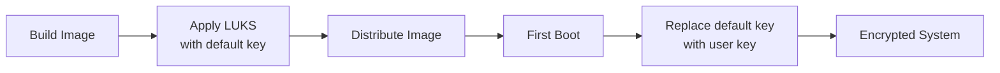
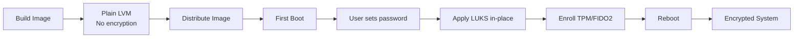

# Deferred Disk Encryption

Deferred disk encryption allows creating unencrypted disk images that are encrypted on first boot when the user provides credentials. This approach provides better security by avoiding pre-set encryption keys in distributed images.

:::note[Default Behavior]
Deferred encryption is **enabled by default** in the `mvp-user-trial.nix` profile and in targets that set `ghaf.storage.encryption.deferred = true`. Images are built with plain LVM and encryption is applied on first boot. This results in smaller image sizes (~7GB vs ~20GB) and better security.
:::

## Overview

### Standard Encryption Flow



**Issues:**
- Image contains LUKS container with default/empty key
- Security risk if image is compromised before first boot
- Default key must be managed and rotated

### Deferred Encryption Flow



**Benefits:**
- ✅ Image is completely plaintext (no default keys)
- ✅ User explicitly chooses encryption password
- ✅ Better security posture
- ✅ No key management for image distribution

## Architecture

### Initrd Execution

The encryption service runs in the **initial RAM disk (initrd)** before the root filesystem is mounted. This design ensures:

- ✅ **No mount conflicts:** Device is not in use during encryption
- ✅ **Early execution:** Runs before systemd main system services
- ✅ **Clean state:** System can reboot after encryption without complex unmounting
- ✅ **Security:** Service runs in minimal environment

**Boot Sequence:**

```
1. Bootloader → Kernel → Initrd
2. Initrd systemd starts
3. cryptsetup-pre-check: Is device LUKS?
   ├─ No → Skip systemd-cryptsetup
   └─ Yes → systemd-cryptsetup unlocks device
4. first-boot-encrypt service:
   ├─ Device NOT LUKS? → Apply encryption
   └─ Device IS LUKS? → Skip (already encrypted)
5. Mount root filesystem
6. Switch to main system
```

### Disk Layout

**Before First Boot (Unencrypted):**
```
/dev/sda1  - boot (1M) - GRUB bootloader
/dev/sda2  - ESP (500M) - EFI System Partition
/dev/sda3  - lvm (rest) - Plain LVM Physical Volume
  └─ VG "pool"
     ├─ LV swap (12G) - Swap space
     ├─ LV root (50G) - Root filesystem (ext4)
     └─ LV persist (rest) - Persistent data (btrfs)
```

**After First Boot (Encrypted):**
```
/dev/sda1  - boot (1M) - GRUB bootloader
/dev/sda2  - ESP (500M) - EFI System Partition
/dev/sda3  - LUKS container "crypted"
  └─ /dev/mapper/crypted - LVM Physical Volume
     └─ VG "pool"
        ├─ LV swap (12G) - Swap space
        ├─ LV root (50G) - Root filesystem (ext4)
        └─ LV persist (rest) - Persistent data (btrfs)
```

### First Boot Process

1. **Early Boot (Initrd):** Service runs in initrd before root filesystem is mounted
2. **Detection:** System detects unencrypted state (device is not LUKS)
3. **User Interaction:**
   - **Debug mode:** Automatic encryption with no password
   - **Release mode:** User prompted for password/PIN (min 4 characters)
4. **In-Place Encryption:** `cryptsetup reencrypt` converts LVM partition to LUKS
5. **Hardware Enrollment:**
   - TPM2: Automatic unlock with optional PIN
   - FIDO2: Unlock with hardware key
   - Recovery key: Generated automatically
6. **Cleanup:** LVM deactivated, LUKS container closed
7. **Reboot:** System restarts with encrypted disk
8. **Second Boot:** LUKS unlocked automatically with TPM/FIDO2

## Configuration

### Basic Setup

```nix
{
  # Deferred encryption module is automatically imported with disko-debug-partition
  ghaf.partitioning.disko.enable = true;

  # Configure encryption with deferred mode
  ghaf.storage.encryption = {
    enable = true;
    deferred = true;  # Apply encryption on first boot, not at build time
    backendType = "tpm2"; # or "fido2"
  };
}
```

### Debug vs Release Mode

**Debug Mode (Development/Testing):**
```nix
{
  ghaf.profiles.debug.enable = true;

  # Behavior:
  # - Encryption applied automatically with empty password
  # - TPM enrolled without PIN requirement
  # - No user interaction needed
  # - Recovery key still generated
}
```

**Release Mode (Production):**
```nix
{
  ghaf.profiles.debug.enable = false;

  # Behavior:
  # - User prompted for password on first boot
  # - Password minimum 4 characters
  # - TPM enrolled with PIN requirement
  # - User must enter PIN on each boot (with TPM)
  # - Recovery key generated and displayed
}
```

### Backend Options

**TPM 2.0 (Recommended):**
```nix
{
  ghaf.storage.encryption.backendType = "tpm2";

  # Features:
  # - Automatic unlock if platform unchanged
  # - Optional PIN for additional security
  # - Measures PCR 7 (Secure Boot state)
  # - Recovery key as fallback
}
```

**FIDO2/U2F:**
```nix
{
  ghaf.storage.encryption.backendType = "fido2";

  # Features:
  # - Requires physical hardware key
  # - User presence verification
  # - Client PIN support
  # - Works with YubiKey, Nitrokey, etc.
}
```

## Building Images

### Build with Deferred Encryption (Default)

```bash
# Build the image - deferred encryption is default in mvp-user-trial targets
nix build .#lenovo-x1-carbon-gen11-debug

# The resulting image will be plain LVM (unencrypted)
# File: result/nixos.raw.zst (compressed)
# Size: ~7GB (compressed with zstd)
```

### Build with Immediate Encryption (Optional)

```bash
# To build with LUKS at build time instead (not recommended):
# Override the configuration to set deferred = false

# Result: LUKS container with empty password
# Size: ~20GB (uncompressible due to encryption)
```

### Flash to Device

:::danger[Data Loss Warning]
**Verify your target device carefully!** Writing to the wrong device (e.g., `/dev/sda` instead of `/dev/sdb`) will **permanently erase all data** on that drive.

Use `lsblk` or check `/dev/disk/by-id/` to confirm the correct device identifier before running `dd`.
:::

```bash
# Decompress if needed
zstd -d result/nixos.raw.zst

# Flash to USB/SSD
sudo dd if=result/nixos.raw of=/dev/sdX bs=4M status=progress conv=fsync

# Or use a more user-friendly tool
sudo gnome-disks  # Select image file and target device
```

## First Boot Experience

### Debug Mode

```
Ghaf System Boot
================

🔧 Debug mode: Applying encryption automatically...
🔄 Preparing system for encryption...
📦 Deactivating logical volumes...

🔐 Encrypting partition...
    This will take several minutes depending on disk size.
    Please do not power off the system!

[Progress bar or spinning indicator]

✅ Encryption complete!
🔓 Opening encrypted device...
📦 Activating logical volumes...
🔑 Enrolling TPM 2.0 for automatic unlock...
✅ TPM enrollment complete!
📝 Updating system configuration...

╔════════════════════════════════════════════════════════╗
║              Encryption Setup Complete!               ║
╚════════════════════════════════════════════════════════╝

Debug mode: System will reboot automatically in 5 seconds...
🔄 Rebooting system...
```

### Release Mode

```
Ghaf System Boot
================

╔════════════════════════════════════════════════════════╗
║         First Boot - Disk Encryption Setup            ║
╚════════════════════════════════════════════════════════╝

This system will now apply full disk encryption to protect
your data. This process is irreversible and required for
system security.

You will be prompted to set a PIN or password.
This will be required on every boot to unlock the system.

Requirements:
  - Minimum 4 characters
  - Cannot be empty

Enter encryption PIN/password: ****
Confirm PIN/password: ****
✅ Password set successfully

🔄 Preparing system for encryption...
📦 Deactivating logical volumes...

🔐 Encrypting partition...
    This will take several minutes depending on disk size.
    Please do not power off the system!

[Progress bar - 15 minutes for 70GB typical]

✅ Encryption complete!
🔓 Opening encrypted device...
📦 Activating logical volumes...

🔑 Enrolling TPM 2.0 for automatic unlock...
🔑 Adding recovery key...

[Recovery key displayed - save this!]
Recovery Key: xxxxx-xxxxx-xxxxx-xxxxx-xxxxx-xxxxx-xxxxx-xxxxx

🗑️  Removing password slot...
✅ TPM enrollment complete!
📝 Updating system configuration...

╔════════════════════════════════════════════════════════╗
║              Encryption Setup Complete!               ║
╚════════════════════════════════════════════════════════╝

Your disk is now fully encrypted and protected.

On next boot:
  • TPM will automatically unlock the disk
  • You may be prompted for your PIN as additional security

Press Enter to reboot and complete setup...

🔄 Rebooting system...
```

## Subsequent Boots

After first boot encryption, the system will boot normally with LUKS:

**With TPM (No PIN):**
```
Loading kernel...
Loading initrd...
[TPM unlocks automatically]
Starting Ghaf...
```

**With TPM + PIN:**
```
Loading kernel...
Loading initrd...
Please enter PIN for disk /dev/sda3: ****
[TPM verifies PIN and unlocks]
Starting Ghaf...
```

**Without TPM (Password required):**
```
Loading kernel...
Loading initrd...
Please enter passphrase for disk /dev/sda3: ********
[Password verified and unlocks]
Starting Ghaf...
```

## Troubleshooting

### Encryption Fails

**Symptom:** Service fails, system won't encrypt

**Check:**
```bash
# After boot, view service logs from previous boot
journalctl -u first-boot-encrypt -b -1

# Check if LVM partition exists
lsblk
pvdisplay

# Check if device is already LUKS
cryptsetup isLuks /dev/sda3 && echo "Already encrypted" || echo "Not encrypted"
```

**Common causes:**
- Partition table mismatch
- Insufficient disk space (need 16MB for LUKS header)
- Corrupted filesystem
- Device already encrypted

**Recovery:**
```bash
# Encryption happens in initrd, so if it fails:
# 1. System will boot to recovery or drop to emergency shell
# 2. Check logs from failed boot: journalctl -b -1
# 3. If device is partially encrypted, must complete or restore from backup
```

### TPM Enrollment Fails

**Symptom:** TPM enrollment error, password required every boot

**Check:**
```bash
# Check TPM availability
ls -la /dev/tpm*

# Check TPM status
systemd-cryptenroll --tpm2-device=list
```

**Solutions:**
- Ensure TPM is enabled in BIOS/UEFI
- Check Secure Boot status: `bootctl status`
- Re-run enrollment manually:
  ```bash
  systemd-cryptenroll --tpm2-device=auto --tpm2-pcrs=7 /dev/sda3
  ```

### Cannot Boot After Encryption

**Symptom:** System fails to boot, drops to emergency shell

**Recovery:**
1. Boot from USB/recovery media
2. Open encrypted device:
   ```bash
   cryptsetup open /dev/sda3 crypted
   vgchange -ay pool
   ```
3. Mount and check configuration:
   ```bash
   mount /dev/pool/root /mnt
   cat /mnt/etc/crypttab
   ```
4. Fix configuration if needed
5. Regenerate initrd:
   ```bash
   nixos-enter
   nixos-rebuild boot
   ```

### Lost Password/PIN

**Recovery with recovery key:**
1. Boot system (will prompt for unlock)
2. Select "Recovery Key" option
3. Enter 64-character recovery key (shown during first boot)
4. System will unlock

**If recovery key also lost:**
- **With TPM:** System should unlock automatically
- **Without recovery key:** Data is unrecoverable (encryption works!)

## Security Considerations

### Image Distribution

✅ **Safe to distribute:**
- Unencrypted images don't contain sensitive data
- No default keys to compromise
- User controls encryption credentials

⚠️ **Best practices:**
- Provide checksum/signature for image verification
- Use HTTPS for distribution
- Document first-boot process clearly

### Key Management

**TPM Keys:**
- Bound to specific hardware
- Cannot be extracted
- Reset if hardware changes significantly

**Recovery Keys:**
- 64-character key generated automatically
- **Must be saved** by user during first boot
- Store securely (password manager, physical safe)

**FIDO2 Keys:**
- Requires physical hardware token
- User presence verification required
- Can enroll multiple tokens

### Attack Scenarios

**Scenario: Attacker intercepts unencrypted image**
- ✅ No sensitive data in image
- ✅ Attacker cannot pre-compromise encryption
- ✅ User's password never transmitted

**Scenario: Evil maid attack (physical access before first boot)**
- ⚠️ Attacker could modify image
- 🛡️ Mitigation: Use Secure Boot with measured boot
- 🛡️ Mitigation: Verify image signature before flashing

**Scenario: Stolen device after encryption**
- ✅ Data protected by LUKS encryption
- ✅ TPM prevents offline attacks
- ✅ Recovery key required for forensics

## Comparison with Build-Time Encryption

| Aspect | Build-Time Encryption | Deferred Encryption (Default) |
|--------|----------------------|-------------------------------|
| **Image state** | LUKS with empty password | Plain LVM, no LUKS |
| **Default security** | Weak (empty password) | Strong (no encryption) |
| **First boot** | Enroll TPM, remove password | Apply LUKS, set password, enroll TPM |
| **User experience** | Fast first boot (~1 min) | Slower first boot (~15 min encryption) |
| **Distribution** | Image has LUKS container (20GB) | Image is plaintext (7GB compressed) |
| **Image size** | ~20GB (uncompressible) | ~7GB (zstd compressed) |
| **Recovery** | Standard recovery key | User-set recovery key |
| **Attack surface** | Default key in image | No encryption to attack |
| **Complexity** | Simple (LUKS exists) | More complex (initrd service, in-place encryption) |
| **Configuration** | `deferred = false` | `deferred = true` (default) |
| **Best for** | Quick testing, trusted environments | Production, public distribution |

## Implementation Details

### Modules

**Partitioning:** `modules/partitioning/disko-debug-partition.nix`
- Defines disk layout with or without LUKS
- Creates LVM on LUKS (encrypted) or plain LVM (deferred)
- Checks `config.ghaf.storage.encryption.deferred` flag
- Compatible with disko image builder

**Encryption Service:** `modules/partitioning/deferred-disk-encryption.nix`
- **Initrd systemd service** for first-boot encryption
- Runs in `boot.initrd.systemd.services` before root mount
- Detects unencrypted state (device not LUKS)
- Handles user interaction (release mode) via TTY
- Performs in-place encryption with `cryptsetup reencrypt`
- Enrolls TPM2/FIDO2 devices
- Deactivates LVM and closes LUKS before reboot
- Automatically imported with `disko-debug-partition`

**Reference Profile:** `modules/reference/profiles/mvp-user-trial.nix`
- Enables deferred encryption by default
- Shows recommended configuration
- Used by most laptop targets

### Technical Details

**Encryption Method:**
- LUKS2 format (modern, flexible)
- AES-XTS-PLAIN64 cipher (default, secure)
- Argon2id PBKDF (memory: 1GB, parallelism: 4; secure against GPU attacks)
- 32MB reserved for LUKS header

**In-Place Encryption:**
- Uses `cryptsetup reencrypt --encrypt`
- Journal-based resilience (crash-safe)
- Minimal data movement
- Approximately 15-20 minutes for 70GB

**Boot Integration:**
- First boot: Service runs in initrd before root mount
- State detection: `cryptsetup isLuks` checks device status
- systemd-cryptsetup skipped on first boot (no LUKS yet)
- systemd-cryptenroll for TPM/FIDO2 enrollment
- Second boot: systemd-cryptsetup unlocks with TPM/FIDO2
- Automatic LVM activation after unlock

## See Also

- [TPM 2.0](https://trustedcomputinggroup.org/resource/tpm-library-specification/) - TPM specification
- [LUKS](https://gitlab.com/cryptsetup/cryptsetup) - Linux Unified Key Setup
- [cryptsetup-reencrypt](https://man7.org/linux/man-pages/man8/cryptsetup-reencrypt.8.html) - In-place encryption tool
- [systemd-cryptenroll](https://www.freedesktop.org/software/systemd/man/systemd-cryptenroll.html) - Key enrollment
