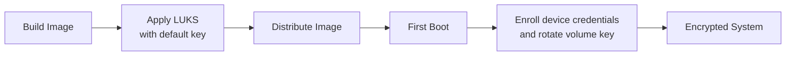
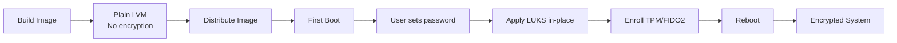

# Deferred Disk Encryption

Deferred disk encryption allows creating unencrypted disk images that are encrypted on first boot when the user provides credentials. This approach provides better security by avoiding pre-set encryption keys in distributed images.

:::note[Default Behavior]
Deferred encryption is **enabled by default** in the `mvp-user-trial.nix` profile and in targets that set `ghaf.storage.encryption.deferred = true`. Images are built with plain LVM and encryption is applied on first boot. Plain images usually compress better; size and encryption time depend on the target. The ESP installer marker must be present to request encryption.
:::

## Overview

### Standard Encryption Flow


```mermaid
graph LR
    A[Build Image] --> B[Apply LUKS<br/>with default key]
    B --> C[Distribute Image]
    C --> D[First Boot]
    D --> E[Enroll device credentials<br/>and rotate volume key]
    E --> F[Encrypted System]
```

**Issues:**
- Image contains LUKS container with default/empty key
- Security risk if image is compromised before first boot
- Replacing a password slot alone does not rotate the shared LUKS volume key

### Deferred Encryption Flow


```mermaid
graph LR
    A[Build Image] --> B[Plain LVM<br/>No encryption]
    B --> C[Distribute Image]
    C --> D[First Boot]
    D --> E[User sets password]
    E --> F[Apply LUKS in-place]
    F --> G[Enroll TPM/FIDO2]
    G --> H[Reboot]
    H --> I[Encrypted System]
```

**Benefits:**
- ✅ Image is completely plaintext (no default keys)
- Interactive setup lets the user choose a password; automated debug setup uses `ghaf`
- ✅ Better security posture
- ✅ No key management for image distribution

## Architecture

### Initrd Execution

The encryption service runs in the **initial RAM disk (initrd)** before the root filesystem is mounted. This design ensures:

- ✅ **No mount conflicts:** Device is not in use during encryption
- ✅ **Early execution:** Runs before systemd main system services
- ✅ **Clean state:** System can reboot after encryption without complex unmounting
- ✅ **Security:** Service runs in minimal environment

**Boot Sequence:**

```
1. Bootloader → Kernel → Initrd
2. Initrd systemd starts
3. first-boot-encrypt checks LUKS metadata and the installer marker:
   ├─ Plain LVM with installer marker? → Apply encryption
   ├─ Installer marker remains? → Recover/resume encryption and finish enrollment
   ├─ Incomplete encryption without installer marker? → Refuse to boot
   └─ Setup complete? → Skip setup
4. Unlock the completed LUKS device on normal boots
5. Mount root filesystem
6. Switch to main system
```

### Disk Layout

The layouts below describe the ordinary disko image. The secure A/B canary has
a Type-2-only ESP and two root/verity pairs; use its
[testing guide](/ghaf/dev/guides/x86-secure-ab-testing) and resolve the actual
partition with `cryptsetup status crypted` rather than copying `/dev/sda3`.

**Before First Boot (Unencrypted):**
```
/dev/sda1  - boot (1M) - GRUB bootloader
/dev/sda2  - ESP (500M) - EFI System Partition
/dev/sda3  - lvm (rest) - Plain LVM Physical Volume
  └─ VG "pool"
     ├─ LV swap (12G default) - Swap space
     ├─ LV root_0 (50G default) - Root filesystem (ext4)
     ├─ LV verity_0 (1G default) - Reserved verity space
     └─ LV persist (2G initially, grows on boot) - Persistent data (btrfs)
```

**After First Boot (Encrypted):**
```
/dev/sda1  - boot (1M) - GRUB bootloader
/dev/sda2  - ESP (500M) - EFI System Partition
/dev/sda3  - LUKS container "crypted"
  └─ /dev/mapper/crypted - LVM Physical Volume
     └─ VG "pool"
        ├─ LV swap (12G default) - Swap space
        ├─ LV root_0 (50G default) - Root filesystem (ext4)
        ├─ LV verity_0 (1G default) - Reserved verity space
        └─ LV persist (2G initially, grows on boot) - Persistent data (btrfs)
```

### First Boot Process

1. **Early Boot (Initrd):** Service runs in initrd before root filesystem is mounted
2. **Detection:** Inspect LUKS reencryption metadata and the ESP installer marker
3. **User Interaction:**
   - **Debug mode:** Automatic encryption with the known development passphrase `ghaf`
   - **Release mode:** User prompted for password/PIN (min 4 characters)
4. **In-Place Encryption:** `cryptsetup reencrypt` converts LVM partition to LUKS
5. **Hardware Enrollment:**
   - TPM2: Automatic unlock with optional PIN
   - FIDO2: Unlock with hardware key
   - Recovery key: Enrollment is attempted after successful hardware enrollment; verify success
6. **Cleanup:** LVM deactivated, LUKS container closed
7. **Reboot:** System restarts with encrypted disk
8. **Second Boot:** Unlock with an enrolled TPM/FIDO2 token, recovery key or retained password

## Configuration

### Basic Setup

```nix
{
  # Deferred encryption module is automatically imported with disko-debug-partition
  ghaf.partitioning.disko.enable = true;

  # Configure encryption with deferred mode
  ghaf.storage.encryption = {
    enable = true;
    deferred = true;  # Apply encryption on first boot, not at build time
    backendType = "tpm2"; # or "fido2"
  };
}
```

### Debug vs Release Mode

`ghaf.storage.encryption.interactiveSetup` controls prompting. The profile
defaults below select interactive release setup and automated debug setup.

**Debug Mode (Development/Testing):**
```nix
{
  ghaf.profiles.debug.enable = true;

  # Behavior:
  # - Encryption applied automatically with development password "ghaf"
  # - TPM enrolled without PIN requirement
  # - No user interaction needed
  # - Recovery enrollment attempted after hardware enrollment succeeds
}
```

**Release Mode (Production):**
```nix
{
  ghaf.profiles.debug.enable = false;

  # Behavior:
  # - User prompted for password on first boot
  # - Password minimum 4 characters
  # - Interactive setup requests a TPM PIN when TPM enrollment succeeds
  # - User must enter PIN on each boot (with TPM)
  # - Recovery key generated and displayed
}
```

### Backend Options

**TPM 2.0 (Recommended):**
```nix
{
  ghaf.storage.encryption.backendType = "tpm2";

  # Features:
  # - Automatic unlock if platform unchanged
  # - Optional PIN for additional security
  # - Measures PCR 7 (Secure Boot state)
  # - Recovery key as fallback
}
```

**FIDO2/U2F:**
```nix
{
  ghaf.storage.encryption.backendType = "fido2";

  # Features:
  # - Requires physical hardware key
  # - User presence verification
  # - Client PIN support
  # - Works with YubiKey, Nitrokey, etc.
}
```

## Building Images

### Build with Deferred Encryption (Default)

```bash
# Build the image - deferred encryption is default in mvp-user-trial targets
nix build .#intel-laptop-debug

# The resulting image will be plain LVM (unencrypted)
# File: result/ghaf-image.raw.zst (compressed)
# Size depends on the selected configuration
```

### Build with Immediate Encryption (Optional)

```bash
# To build with LUKS at build time instead (not recommended):
# Override the configuration to set deferred = false

# Result: LUKS container with empty password
# Encrypted content compresses poorly
```

### Flash to Device

:::danger[Data Loss Warning]
**Verify your target device carefully!** Writing to the wrong device (e.g., `/dev/sda` instead of `/dev/sdb`) will **permanently erase all data** on that drive.

Use `lsblk` or check `/dev/disk/by-id/` to confirm the correct device identifier before running `dd`.
:::

```bash
# Decompress if needed
zstd -d result/ghaf-image.raw.zst -o /var/tmp/ghaf-image.raw

# Flash to the confirmed USB/SSD device
sudo dd if=/var/tmp/ghaf-image.raw of=/dev/sdX bs=4M status=progress conv=fsync

# Or use a more user-friendly tool
sudo gnome-disks  # Select image file and target device
```

For ordinary laptop images, prefer `ghaf-installer -e`, which creates the
`.ghaf-installer-encrypt` marker on the ESP. A raw flash does not add that marker;
confirm it exists before expecting deferred encryption. Secure A/B images
already include the marker and require the signing/install procedure in their
[testing guide](/ghaf/dev/guides/x86-secure-ab-testing).

## First Boot Experience

The screens below are illustrative. Hardware enrollment and recovery-key
creation can fail; confirm the resulting tokens and retain a working credential.

### Debug Mode

```
Ghaf System Boot
================

🔧 Debug mode: Applying encryption automatically...
🔄 Preparing system for encryption...
📦 Deactivating logical volumes...

🔐 Encrypting partition...
    This will take several minutes depending on disk size.
    Please do not power off the system!

[Progress bar or spinning indicator]

✅ Encryption complete!
🔓 Opening encrypted device...
📦 Activating logical volumes...
🔑 Enrolling TPM 2.0 for automatic unlock...
✅ TPM enrollment complete!
📝 Updating system configuration...

╔════════════════════════════════════════════════════════╗
║              Encryption Setup Complete!               ║
╚════════════════════════════════════════════════════════╝

Debug mode: System will reboot automatically in 5 seconds...
🔄 Rebooting system...
```

### Release Mode

```
Ghaf System Boot
================

╔════════════════════════════════════════════════════════╗
║         First Boot - Disk Encryption Setup            ║
╚════════════════════════════════════════════════════════╝

This system will now apply full disk encryption to protect
your data. This process is irreversible and required for
system security.

You will be prompted to set a PIN or password.
This will be required on every boot to unlock the system.

Requirements:
  - Minimum 4 characters
  - Cannot be empty

Enter encryption PIN/password: ****
Confirm PIN/password: ****
✅ Password entered

🔄 Preparing system for encryption...
📦 Deactivating logical volumes...

🔐 Encrypting partition...
    This will take several minutes depending on disk size.
    Please do not power off the system!

[Progress bar - 15 minutes for 70GB typical]

✅ Encryption complete!
🔓 Opening encrypted device...
📦 Activating logical volumes...

🔑 Enrolling TPM 2.0 for automatic unlock...
🔑 Adding recovery key...

[Recovery key displayed - save this!]
Recovery Key: xxxxx-xxxxx-xxxxx-xxxxx-xxxxx-xxxxx-xxxxx-xxxxx

✅ TPM enrollment complete!
📝 Updating system configuration...

╔════════════════════════════════════════════════════════╗
║              Encryption Setup Complete!               ║
╚════════════════════════════════════════════════════════╝

Your disk is now fully encrypted and protected.

On next boot:
  • TPM will automatically unlock the disk
  • You may be prompted for your PIN as additional security

Press Enter to reboot and complete setup...

🔄 Rebooting system...
```

## Subsequent Boots

After first boot encryption, the system will boot normally with LUKS:

**With TPM (No PIN):**
```
Loading kernel...
Loading initrd...
[TPM unlocks automatically]
Starting Ghaf...
```

**With TPM + PIN:**
```
Loading kernel...
Loading initrd...
Please enter PIN for disk /dev/sda3: ****
[TPM verifies PIN and unlocks]
Starting Ghaf...
```

**Without TPM (Password required):**
```
Loading kernel...
Loading initrd...
Please enter passphrase for disk /dev/sda3: ********
[Password verified and unlocks]
Starting Ghaf...
```

## Troubleshooting

### Encryption Fails

**Symptom:** Service fails, system won't encrypt

**Check:**
```bash
# In the failed boot initrd/emergency shell, inspect service status
journalctl -b -u first-boot-encrypt --no-pager

# Check if LVM partition exists
lsblk
pvdisplay

# A LUKS header alone does not prove encryption finished
cryptsetup isLuks /dev/sda3 && cryptsetup luksDump /dev/sda3
```

**Common causes:**
- Partition table mismatch
- Insufficient disk space (32 MiB reserved for the LUKS header)
- Corrupted filesystem
- Setup already completed

**Recovery:**
```bash
# Encryption happens in initrd, so if it fails:
# 1. Capture the console and current-boot service status.
# 2. Keep the installer marker and reboot with the existing credential.
# 3. Setup repairs/resumes unfinished encryption before enrollment.
# Never run a fresh --encrypt operation over a partially encrypted device.
```

The service sends its detailed output directly to its TTY, not to the journal.
An early crash may leave no persistent journal on disk, and `journalctl -b -1`
only works if that boot was retained. Capture the display or configured console
before retrying; do not assume a missing journal means encryption completed.
The resume path requires the ESP marker. If it is missing while reencryption is
incomplete, setup refuses to boot; investigate the marker and disk identity
instead of bypassing the check.

### TPM Enrollment Fails

**Symptom:** TPM enrollment error, password required every boot

**Check:**
```bash
# Check TPM availability
ls -la /dev/tpm*

# Check TPM status
systemd-cryptenroll --tpm2-device=list
```

**Solutions:**
- Ensure TPM is enabled in BIOS/UEFI
- Check Secure Boot status: `bootctl status`
- Re-run enrollment manually:
  ```bash
  systemd-cryptenroll --tpm2-device=auto --tpm2-pcrs=7 /dev/sda3
  ```

### Cannot Boot After Encryption

**Symptom:** System fails to boot, drops to emergency shell

**Recovery:**
1. Boot from USB/recovery media
2. Open encrypted device:
   ```bash
   cryptsetup open /dev/sda3 crypted
   vgchange -ay pool
   ```
3. For a conventional writable-root image, mount the root and inspect its
   configuration. For secure A/B, the store is immutable and verity-protected:
   select the surviving signed healthy entry or rebuild/sign an update. Do not
   apply the conventional `nixos-enter`/`nixos-rebuild` repair procedure to a
   root/verity slot.

### Lost Password/PIN

**Recovery with recovery key:**
1. Boot system (will prompt for unlock)
2. Enter the enrolled recovery key at the LUKS passphrase prompt
3. Use the complete key exactly as displayed during enrollment
4. System will unlock

**If recovery key also lost:**
- A working TPM/FIDO2 token or retained password slot may still unlock the disk.
- If no enrolled credential works, the encrypted data cannot be recovered by resetting a password.

## Security Considerations

### Image Distribution

✅ **Safe to distribute:**
- Unencrypted images don't contain sensitive data
- No default keys to compromise
- User controls encryption credentials

⚠️ **Best practices:**
- Provide checksum/signature for image verification
- Use HTTPS for distribution
- Document first-boot process clearly

### Key Management

**TPM Keys:**
- Bound to specific hardware
- Unlock depends on the enrolled PCR policy and optional PIN
- Firmware/Secure Boot changes can require recovery unlock

**Recovery Keys:**
- Generated by `systemd-cryptenroll` after successful hardware enrollment
- **Must be saved** by user during first boot
- Store securely (password manager, physical safe)

**FIDO2 Keys:**
- Requires physical hardware token
- User presence verification required
- Can enroll multiple tokens

### Protection boundaries

Authenticate the distributed image before first boot: an attacker who modifies
an unencrypted image can change the provisioning code. Encryption alone does
not authenticate the boot chain. A plaintext build must contain no secrets.
TPM enrollment protects an unlock credential according to its PCR/PIN policy;
it does not guarantee that a stolen device cannot boot and unlock automatically.

The current deferred setup retains its password slot. In debug mode that
password is `ghaf`, so hardware enrollment does not remove the known development
unlock path. Verify hardware tokens and recovery enrollment rather than inferring
success from the encryption-complete screen.

## Comparison with Build-Time Encryption

| Aspect | Build-Time Encryption | Deferred Encryption (Default) |
|--------|----------------------|-------------------------------|
| **Image state** | LUKS with empty password | Plain LVM, no LUKS |
| **Volume key** | Shared across copies until reencryption | Created independently on each device |
| **First boot** | Rotate shared volume key and enroll device credentials | Apply LUKS and enroll device credentials |
| **Distribution** | Encrypted bytes compress poorly | Plain bytes usually compress better |
| **Recovery** | Depends on enrollment policy | Recovery enrollment attempted after hardware enrollment |
| **Configuration** | `deferred = false` | `deferred = true` |

Removing a bootstrap password slot is not equivalent to replacing a shared
volume key. Both approaches still require authenticated images and verification
of the final credential policy.

## Implementation Details

### Modules

**Partitioning:** `modules/partitioning/disko-debug-partition.nix`
- Defines disk layout with or without LUKS
- Creates LVM on LUKS (encrypted) or plain LVM (deferred)
- Checks `config.ghaf.storage.encryption.deferred` flag
- Compatible with disko image builder

**Encryption Service:** `modules/partitioning/deferred-disk-encryption.nix`
- **Initrd systemd service** for first-boot encryption
- Runs in `boot.initrd.systemd.services` before root mount
- Checks the installer marker and LUKS reencryption state, including interrupted setup
- Handles user interaction (release mode) via TTY
- Performs in-place encryption with `cryptsetup reencrypt`
- Enrolls TPM2/FIDO2 devices
- Deactivates LVM and closes LUKS before reboot
- Automatically imported with `disko-debug-partition`

**Reference Profile:** `modules/reference/profiles/mvp-user-trial.nix`
- Enables deferred encryption by default
- Shows recommended configuration
- Used by most laptop targets

### Technical Details

**Encryption Method:**
- LUKS2 format (modern, flexible)
- AES-XTS-PLAIN64 cipher (default, secure)
- Argon2id PBKDF (memory: 1GB, parallelism: 4; secure against GPU attacks)
- 32MB reserved for LUKS header

**In-Place Encryption:**
- Fresh setup uses `cryptsetup reencrypt --encrypt`; interrupted setup repairs and uses `--resume-only`
- Journal-based resilience (crash-safe)
- Minimal data movement
- Approximately 15-20 minutes for 70GB

**Boot Integration:**
- First boot: Service runs in initrd before root mount
- State detection: `cryptsetup isLuks` plus LUKS2 JSON reencryption metadata and the ESP marker
- systemd-cryptsetup skipped on first boot (no LUKS yet)
- systemd-cryptenroll for TPM/FIDO2 enrollment
- Second boot: systemd-cryptsetup unlocks with TPM/FIDO2
- Automatic LVM activation after unlock

## See Also

- [TPM 2.0](https://trustedcomputinggroup.org/resource/tpm-library-specification/) - TPM specification
- [LUKS](https://gitlab.com/cryptsetup/cryptsetup) - Linux Unified Key Setup
- [cryptsetup-reencrypt](https://man7.org/linux/man-pages/man8/cryptsetup-reencrypt.8.html) - In-place encryption tool
- [systemd-cryptenroll](https://www.freedesktop.org/software/systemd/man/systemd-cryptenroll.html) - Key enrollment
