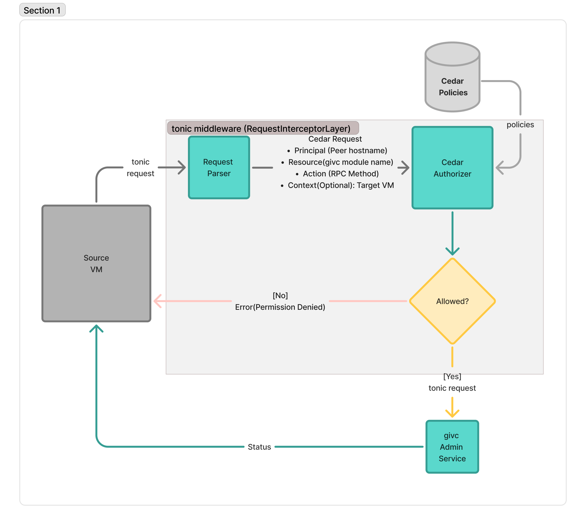
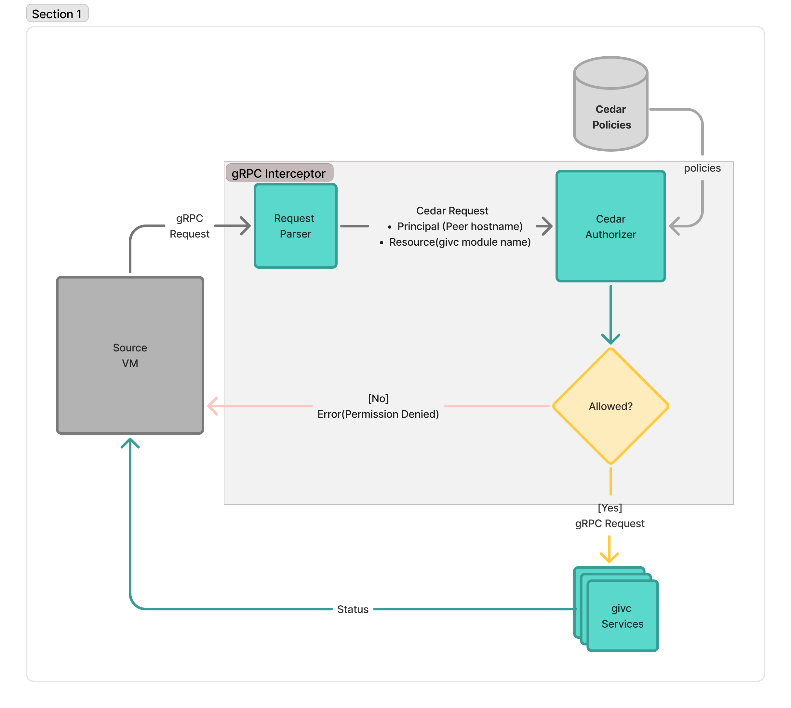

# Ghaf Access Control

Ghaf Inter-VM Communication (GIVC) includes an access control mechanism to secure and restrict communication between virtual machines and the host. In the backend, the high-level Nix access control configurations defined by users are automatically transformed and compiled into **Cedar policies** to enforce fine-grained security rules at runtime.

## 1. Architectural Overview

When access control is enabled, the ACL system operates on a default-deny principle (except for the built-in `ServerReflectionInfo`). Before executing any RPC method, the gRPC interceptor/middleware evaluates the request against the injected Cedar policies. If it is allowed, it forwards the request to the underlying layer; otherwise, it returns a "permission denied" error. Here are the building blocks and control flow diagram for access control enforcement in GIVC admin and agents.

### 1.1 GIVC Authorization: Why Cedar was chosen

Within Ghaf's `GIVC` framework, authorizing access across VMs requires an authorization engine that matches the system's strict zero-trust and performance requirements.

Cedar serves as the backend engine embedded within the gRPC transport interceptor layer, chosen for the following advantages:

#### 1.1.1 Simplicity and Nix Integration

Cedar uses a simple syntax built on straightforward `permit` and `forbid` clauses. The Cedar engine is highly independent and lightweight, which makes it much simpler to use inside the gRPC interceptor layer. Because of this architectural separation, it can be easily coupled or decoupled depending on your system configuration.

This overall simplicity ensures that declarative NixOS rules can be translated into operational Cedar policies. Crucially, Cedar follows a strict default-deny model—blocking all traffic unless it is explicitly allowed—which naturally satisfies Ghaf's zero-trust security architecture.

#### 1.1.2 Low-Overhead Evaluation

Cedar uses specialized automated reasoning and direct graph traversal to evaluate policies in constant time. By completely avoiding heavy regular expressions or runtime script execution, the engine guarantees low latency overhead across high-throughput inter-VM communication channels.

#### 1.1.3 Suitable APIs

The GIVC network runs on a hybrid software stack: the central Admin Service is written in Rust, while the localized client agents running on individual VMs are built in Go. Cedar natively bridges APIs for both ecosystems. This dual-language API support allows the framework to share and execute the exact same policy definitions natively in both environments.

### 1.2 Building Blocks

This flow shows how a request moves from a Source VM through an access control module implemented in the interceptor/middleware before reaching the gRPC service. The system checks the request details against security policies to either allow or deny the request.

#### 1.2.1 Actor:
- **Source VM:** The source VM that initiates a gRPC request.

#### 1.2.2 Core Processes:
- **[Parser] Context Extraction:** The Request Parser extracts request headers and payload data, formatting them into the Cedar objects (*Principal*, *Resource*, *Action*, and *Context*) required to evaluate the authorization request.
- **[Cedar Authorizer] Policy Verification:** The `Cedar Authorizer` evaluates the request against the active `Cedar Policies`.
- **Gatekeeping:** If **Allowed**, the request drops into the `GIVC Admin Service` and returns an execution `Status`. If **Denied**, it triggers an instant `Permission Denied` error.

The Admin and Agents both evaluate requests using the Cedar authorizer. Since the Admin accepts requests only for the admin GIVC module, and it also works as a proxy between two VMs, more parameters are needed in the authorization requests (e.g., the RPC method and target VM as Cedar context).

**Flow diagram in GIVC Admin:**

**Flow diagram in GIVC Agents:**

### 1.3 Cedar Entity Mapping

To facilitate fine-grained control, incoming gRPC requests are dynamically mapped to Cedar entities:

- **Principal (`Source`)**: The identity of the calling VM, securely extracted from the TLS Subject Alternative Name (SAN).
- **Resource (`Module`)**: The target gRPC service module (e.g., `systemd`, `admin`, `stats`).
- **Action (`Command`)**: The specific gRPC method being invoked (e.g., `StartApplication`, `Reboot`, `RegisterService`).
- **Context (`context`)**: The gRPC protobuf request payload, converted to a Cedar record (e.g., checking `context.VmName` or `context.UnitName`). **The context is evaluated only for unary requests; it is completely ignored in streaming requests.**

## 2. Core Access Control Options

To configure or modify access control, the following module options are available:

- **`ghaf.givc.accessControl.commonAdminRules`**
  - **Description:** A list of top-level access rules defining what individual VMs are authorized to send to, or proxy through, the central Admin VM.
- **`givc.appvm.accessControl.agentRules`**
  - **Description:** Defines fine-grained local rules for application VM agents, specifying which external VMs can directly access local service modules (such as `systemd` or `stats`).
- **`givc.admin.accessControl.adminRules`**
  - **Description:** Defines fine-grained configuration rules applied directly to the Admin VM to control service consumption and traffic routing.

> **Note:** For specific field definitions within these rules (such as `from`, `to`, `permittedRequests`, and `permittedModules`), please check the module option documentation for the latest schema definitions.

## 3. Default Configurations Derived in Code

Ghaf provides a secure baseline right out of the box by automatically setting up default ACL rules for each VM profile based on its active settings. The system then dynamically injects specific rules to meet core functional requirements.

For instance, the GIVC module automatically derives these rules from the capabilities enabled within each respective VM. As an example, if the exec module is enabled on a host VM, the configuration engine automatically generates a rule allowing the Admin VM to access that specific execution boundary.

Access control is enabled by default across all VMs. The framework maintains a strict zero-trust policy, blocking all agent-to-agent, agent-to-admin, and admin-to-agent communication channels unless a module configuration explicitly acts as a capability toggle to auto-derive an allowed path.
