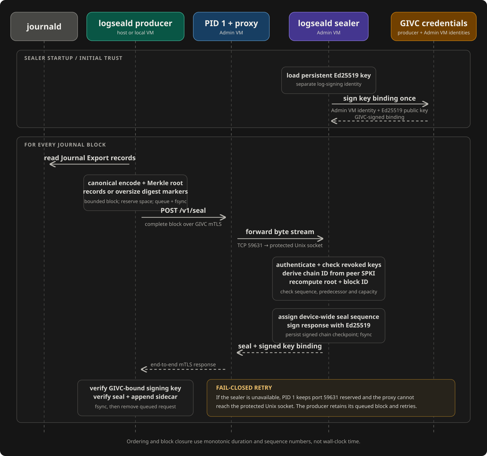

Ghaf uses `logseald` to provide clock-independent tamper evidence for system
and audit logs. Every logging-enabled component seals records from its local
journal. The Admin VM validates and signs those component chains.

Log sealing protects integrity. It does not encrypt log content. Logs remain
readable through `journalctl` and remain available in Grafana.

## Architecture

The host and every logging-enabled virtual machine run a producer. The Admin
VM runs a producer for its own journal and the central sealer for all producers.

```text
Host journald --------> Host producer ---------+
System VM journald ---> System VM producer ----+-- mTLS --> Admin VM sealer
Application VM journal > Application producer -+                 |
Admin VM journald ----> Admin VM producer -----+                 v
                                                       Signed chain checkpoint
```

The following sequence shows the initial trust binding and the complete path of
one journal block through the current implementation:



_Figure 1. The current logseald sequence. The producer queues a complete block
before sending it. The sealer independently validates the full block and persists
a compact signed chain checkpoint before returning a verifiable seal._

The current software signing backend uses a persistent Ed25519 key. A TPM or
TEE signing backend is not part of this flow.

The application, protocol, verifier, unit tests and Nix package are maintained
in [ghaf-logseald](https://github.com/tiiuae/ghaf-logseald). Ghaf pins its source
in `flake.lock` and builds it with Ghaf's Nixpkgs. Service hardening, GIVC
credentials, VM placement, persistence and NixOS integration tests remain here.
Changing the source repository does not reset keys or change existing evidence.

Each producer seals records before the normal journal forwarding path
aggregates them. Log forwarding and log sealing therefore remain independent.
An unavailable remote logging service does not stop local sealing.

### Producer

The producer reads the local journal export stream. Journal records can contain
binary values and duplicate fields, so the producer uses a binary-safe
canonical encoding instead of a text or map representation.

Live records are limited to 256 KiB of canonical data. Larger entries, including
entries whose many individually small fields exceed this budget, are streamed
into an explicit `oversize-export-digest-v1` marker. Its
`_LOGSEALD_EXPORT_SHA256` and `_LOGSEALD_EXPORT_BYTES` fields commit to the raw
journal export entry, including binary framing and its terminating blank line.
The marker preserves the journal cursor and boot ID. It does **not** contain the
original field values; verification of its digest requires the original export
bytes in the same order. Journald and Grafana retain their normal content and
retention policies. Malformed export framing fails closed rather than being
silently skipped.

Blocks close at 256 records, the configured interval, the 1 MiB live block
budget, or a boot-ID boundary, whichever comes first.

The producer groups records into blocks. Each block contains:

- Authenticated producer chain identifier
- Component name
- Producer sequence number
- Previous block identifier
- Boot identifier
- First and last journal cursors
- Canonical journal records
- Merkle root of the records

The producer writes the complete block into its durable queue before it advances
the recoverable journal cursor. This ordering prevents an acknowledged cursor
from referring to a block that was never stored.

### Sealer

The producer sends the complete block to the sealer over mutually authenticated
TLS. The sealer does not sign an opaque producer-supplied digest. It decodes the
block and recomputes its canonical representation, Merkle root, and block
identifier.

The sealer binds the chain to the authenticated GIVC certificate. It then checks
the producer sequence and predecessor against the accepted chain head. An
accepted block receives a device-wide seal sequence and an Ed25519 signature.
The sealer persists a signed checkpoint containing each producer's current
chain head and latest receipt before replying. It does not retain full blocks.

The sealer signs a domain-separated binding between its Ed25519 signing key and
the authenticated GIVC transport identity. The producer verifies this binding
against the server certificate from the TLS connection before it pins the
signing key or accepts a seal. It persists the sealed artifact before deleting
the queued request. Retrying the latest request for a chain returns its original
seal, even after restart or traffic from other producers. Older requests are
rejected, not signed again. Producers submit pending requests in sequence.

## Clock-Independent Operation

Block order, block closure, chaining, and signing do not depend on wall-clock
time. The block interval uses process duration rather than realtime. Sequence
numbers provide the security order.

The producer reads journals through the `systemd-journal` group without changing
journald's startup credentials. VM persistence preserves the journal directory
as `2755 root:systemd-journal`. A dedicated oneshot service,
`logseald-journal-permissions.service`, runs after normal tmpfiles setup and
before the producer. It applies only its private permission rules, repairing
local journal directories to that mode and journal files to `0640 root:systemd-journal`.
The directory setgid bit makes replacement files inherit the reader group after
rotation. Only this dedicated permission service receives `CAP_FSETID`, alongside
the capabilities needed to repair ownership and modes. Existing tmpfiles service
hardening and journald credentials remain unchanged; the producer remains
unprivileged. The setup service reruns when normal tmpfiles setup is restarted.
Repairs do not recursively change other files, grant write access to producers,
or alter signing-key permissions.

Logseald uses the `static-cert` TLS time policy by default. This policy verifies
the certificate authority, peer name, signatures, and key usage at a time within
the certificate chain validity interval. It does not trust the device clock and
does not enforce certificate expiration. An offline public-key denylist provides
explicit revocation; deploying and updating that list is an administrative
responsibility. There is no automatic CRL or OCSP retrieval.

If the Admin VM is unavailable, producers continue to create chained blocks in
their durable queues. At the configured queue limit, a producer stops consuming
new journal entries and retries the oldest block. Journald retains records that
have not reached the producer queue, subject to the configured journal retention
limits.

## Identity and Key Separation

Logseald reuses the GIVC public key infrastructure for transport authentication:

```text
/etc/givc/ca-cert.pem
/etc/givc/cert.pem
/etc/givc/key.pem
```

Systemd passes these files to each unprivileged logseald service as private
credentials. The SHA-256 fingerprint of the authenticated certificate public
key identifies the producer chain.

Private systemd credential copies do not make the original GIVC key exclusive
to logseald. In GUI and application VMs, GIVC also exposes this key to ordinary
users for legitimate clients. Those users can therefore impersonate the
producer, submit fabricated records or advance its chain ahead of the real
producer. This configuration authenticates a **VM key holder**, not uniquely the
journal-reading service. Firewall rules and the separate Ed25519 signing key do
not close that boundary. Do not treat seals from these VMs as protection against
a compromised local user. Root-only, separately provisioned producer identities
are required for that stronger guarantee; they are not provisioned by this module.

The GIVC CA and the exact `admin-vm` certificate identity are the initial root
of trust. The GIVC key authenticates the network endpoint and certifies the
separate Ed25519 log-signing key once per sealer start. It does not sign each log
block. The sealer stores the Ed25519 key at:

```text
/var/lib/logseald/sealer/sealer.key
```

Separating these roles prevents a log-signing operation from becoming a general
GIVC identity operation.

## Network Boundary

The sealer process does not own the TCP port. PID 1 continuously owns port
`59631` on the Admin VM's internal GIVC address and activates an unprivileged
systemd socket proxy. The proxy forwards the byte stream to a protected Unix
socket owned by the sealer. If the sealer stops or crashes, the TCP port remains
reserved, proxy connections fail closed, and producers retain blocks in their
durable queues.

The sealer runs as user `logseald-sealer` with process group `logseald-proxy`,
so newly created sockets are accessible to the proxy after every restart.
The runtime directory uses mode `0750` and the socket `0660`; setgid directory
inheritance is not required. The sealer state directory remains owner-only
(`0700`) and its signing key remains `0600`, denying the proxy access to them.

The Ghaf firewall removes this port from the generic allow-list and admits new
connections only from the configured internal Ghaf node addresses. This source
filter limits exposure but is not producer authentication: every request must
still complete mTLS and the sealer binds the block chain to the authenticated
certificate public key.

## Configuration

Logseald is enabled by default when global logging is enabled. Disable it across
the host and all virtual machines with:

```nix
ghaf.global-config.logging.logseald.enable = false;
```

Disabling the service preserves producer and sealer state. It does not disable
journald, Fail2Ban, journal forwarding, Grafana, or the FSS implementation.

The central sealer listens on TCP port `59631`. Configure a different port with:

```nix
ghaf.global-config.logging.logseald.port = 59631;
```

The feature requires global logging, GIVC, and GIVC TLS. The component-level
module exposes these settings under `ghaf.logging.logseald`:

| Option                          | Default               | Purpose                                                 |
| ------------------------------- | --------------------- | ------------------------------------------------------- |
| `producer.blockRecords`         | `256`                 | Maximum records in one block                            |
| `producer.blockIntervalSeconds` | `5`                   | Maximum duration of an in-memory block                  |
| `producer.maxPendingBlocks`     | `64`                  | Durable blocks retained while the sealer is unavailable |
| `producer.retryIntervalSeconds` | `2`                   | Delay between delivery attempts                         |
| `endpoint.port`                 | `59631`               | Sealer TCP port                                         |
| `endpoint.serverName`           | `admin-vm`            | Expected GIVC certificate identity                      |
| `tls.timePolicy`                | `static-cert`         | Certificate time validation policy                      |
| `tls.revokedPeerKeys`           | `[]`                  | Denied peer leaf SPKI identities                        |
| `producer.maxStateBytes`        | `268435456` (256 MiB) | Queue and sealed evidence byte budget                   |
| `producer.maxStateEntries`      | `100000`              | Total producer evidence entry limit                     |
| `producer.windowEntries`        | `20000`               | Maximum retained sealed blocks, shortened by byte pressure |
| `sealer.maxStateBytes`          | `1073741824` (1 GiB)  | Compact checkpoint budget, including atomic replacement                              |
| `sealer.maxStateEntries`        | `100000`              | Identity limit, additionally capped at 256                              |
| `sealer.maxChainBytes`          | `134217728` (128 MiB) | Legacy migration per-producer byte limit                 |
| `sealer.maxChainEntries`        | `20000`               | Legacy migration per-producer entry limit                 |

### Offline Revocation

Add compromised **leaf public-key** identities to
`ghaf.global-config.logging.logseald.revokedPeerKeys`. Each element has the form
`spki-sha256:` followed by 64 lowercase hexadecimal characters. Obtain a leaf ID
from its certificate (this reads no private key):

```bash
openssl x509 -in /etc/givc/cert.pem -pubkey -noout |
  openssl pkey -pubin -outform DER |
  sha256sum
```

Prefix the resulting digest with `spki-sha256:`. Deploy the list to the host and
**all** participating VMs and restart their producer/sealer services. A host-only
configuration switch does not update already running guests. Policy is loaded
at service startup; existing connections must be terminated by restarting the
services. Both TLS modes enforce the list on new and resumed handshakes. Renewing
a certificate using a denied key cannot bypass the list. To distrust a CA,
replace the CA trust bundle; the denylist targets leaf keys, not CAs.

Changing a producer public key changes its chain identity. Existing state must
not be silently reset or relabelled during rotation; preserve it and plan an
explicit new-chain transition. Revocation does not invalidate signatures on
previously retained evidence or reveal when a key was first compromised.

### Capacity and Memory

The sealer admits one request body at a time, with a 2 MiB HTTP body limit and a
1 MiB decoded live block limit. The socket proxy permits at most 16 connections.
Producer queues and sealed history retain compact metadata in memory; pending
bodies are read from disk on demand. Startup verifies evidence files one at a
time rather than loading the full ledger into memory.

Systemd applies `MemoryHigh`/`MemoryMax` of 192/256 MiB to each producer and
256/384 MiB to the sealer, with no swap allowance. These are pressure/hard limits,
not reserved memory or measured normal consumption. The producer limit also
covers its `journalctl` subprocess. Go GC targets are 128 MiB and 192 MiB;
those are soft targets, not replacements for systemd containment. An exhausted
memory limit can stop sealing in that service; it does not guarantee availability
under sustained attack or sufficient memory for every VM configuration.

### Sliding Evidence Window

Each producer retains at most 20000 sealed blocks within the 256 MiB evidence
budget, including its pending queue. At one block every five seconds, this is
about 28 hours. It is not a one-day guarantee: busy producers fill blocks faster
and byte pressure can shorten the window. Sequence numbers and bytes control
expiry, so wall-clock jumps and Internet connectivity do not change it.

Only acknowledged blocks expire. The producer durably writes the last expired
block's signed receipt as a boundary before deleting the block. It keeps at least
one sealed block to recover the journal cursor. Pending blocks are never expired,
and space is reserved for their returned seals. If pending data or an individual
block cannot fit, ingestion still stops with exit status 75. Journal retention
can then remove records that have not been consumed.

The sealer retains one current signed head and latest retry receipt per identity,
not a full-block ledger. Its signed checkpoint is capped at 1 MiB and 256 identities.
Atomic replacement temporarily needs a second checkpoint copy. The byte budget
must cover both. Old identities are not automatically forgotten, since forgetting
one would permit replay of its old chain. At the identity cap, existing chains
continue but new identities are rejected. Plan key rotation accordingly.

On upgrade, the sealer verifies the legacy ledger, commits its compact checkpoint
and removes the old full-block entries. Producers expire acknowledged history to
their configured window. This is a one-way storage migration. Back up evidence
before upgrading if older history is needed, and do not run the old binary
against migrated state. Keys, counters and retained state survive reboots.

Set `producer.windowEntries = 0` to disable further producer expiry. Already
expired evidence is not recoverable. Verification checks retained evidence and
reports the expired prefix explicitly. Sealer verification checks its checkpoint
and current heads, not historical block contents. Neither verifies that Grafana
has archived records or receipts, and forwarding does not trigger deletion.

Keep additional space for filesystem overhead, producer boundary/pin/lock metadata,
temporary atomic writes, journals and other services. Writers are exclusive,
and verification uses a shared state lock to avoid racing cleanup. Verification
does not prune or migrate evidence. Limit overrides remain available through
`--max-state-bytes`, `--max-state-entries` and legacy sealer `--max-chain-*`.

The v1 archival format limits remain unchanged. Before upgrading an existing
installation, drain any pending blocks larger than the new 1 MiB live limit;
they cannot be split without changing their committed identity. Historical
large artifacts can need more memory during verification than the service caps.
Every service startup re-verifies retained history: offline verification alone
does **not** avoid that requirement. Before upgrading such a store, measure its
startup memory on a suitably sized maintenance system and set
`ghaf.logging.logseald.producer.memoryMaxMiB` or
`ghaf.logging.logseald.sealer.memoryMaxMiB` above that peak with headroom. These
default to 256 and 384 respectively. Provision the VM with sufficient RAM for
the increased cap **and** its other services; do not increase caps blindly on a
1 GiB Admin VM. Retain the larger cap while those artifacts remain in active
history. Existing stores
above the configured capacity fail closed until capacity is provisioned.

## Services and State

| Component         | Service                                                   | State directory                     |
| ----------------- | --------------------------------------------------------- | ----------------------------------- |
| Host producer     | `logseald-producer.service`                               | `/persist/common/logseald/producer` |
| VM producer       | `logseald-producer.service`                               | `/var/lib/logseald/producer`        |
| Admin VM sealer   | `logseald-sealer.service`                                 | `/var/lib/logseald/sealer`          |
| Admin VM listener | `logseald-sealer.socket`, `logseald-sealer-proxy.service` | `/run/logseald-sealer/sealer.sock`  |

Producer state contains queued requests, sealed artifacts, and the pinned
sealer public key, plus a signed boundary after expiry. The central state contains
the Ed25519 signing key and compact signed checkpoint. VM state is persisted through the Storage VM when storage
persistence is enabled, including the Media VM's logseald state even though its
application/user state remains ephemeral.

## Verify a Deployment

### Host Producer

Check the service:

```console
sudo systemctl is-active logseald-producer.service
sudo systemctl status logseald-producer.service --no-pager
sudo journalctl -b -u logseald-producer.service -n 50 --no-pager -l
```

Verify the host chain and signatures:

```console
sudo logseald verify-producer \
  --state-dir /persist/common/logseald/producer \
  --cert /etc/givc/cert.pem \
  --source "$(hostname)"
```

### Admin VM

In the Admin VM, check the services, socket, and listener:

```console
sudo systemctl is-active logseald-producer.service logseald-sealer.service logseald-sealer.socket
sudo ss -ltnp | grep -F ':59631'
```

Verify the Admin VM producer and compact sealer checkpoint:

```console
sudo logseald verify-producer \
  --state-dir /var/lib/logseald/producer \
  --cert /etc/givc/cert.pem \
  --source "$(hostname)"

sudo logseald verify-sealer --state-dir /var/lib/logseald/sealer
```

Successful verification reports `PASS` and the number of sealed or queued
blocks. A queued block count of zero means the producer has received seals for
all durable requests.

### Pipeline Marker

Create a unique journal record on the host and wait for the default block
interval:

```console
logseal_state=/persist/common/logseald/producer
before=$(sudo find "$logseal_state/sealed" -type f -name '*.json' | wc -l)

marker="LOGSEAL_PIPELINE_TEST_$(date +%s)"
systemd-cat --identifier=logseald-test echo "$marker"
journalctl -b -t logseald-test -o cat --no-pager | grep -F -- "$marker"

sleep 12
after=$(sudo find "$logseal_state/sealed" -type f -name '*.json' | wc -l)

test "$after" -gt "$before" && echo "PASS: new block sealed"
```

Run `verify-producer` and `verify-sealer` again after this test. Other system
activity can create additional blocks while the commands run.

## Troubleshooting

### Producer Queues Locally

This message means the producer could not reach the sealer:

```text
seal submission unavailable; queueing locally
```

Check the sealer service, sealer socket and proxy units, TCP listener, Admin VM
connectivity, and GIVC credentials. A later `seal submission recovered` message
confirms that delivery resumed. Persistent queued blocks remain under the
producer `queue` directory.

### Verification Fails

Treat a verification failure as an integrity or state-continuity failure. Do not
delete or rewrite the queue, sealed artifacts, pinned key, signing key, or
ledger. Preserve the complete state directories before investigating the first
reported sequence or signature error.

### Certificate Changes

The producer pins the first signing key whose binding verifies under the
authenticated Admin VM GIVC identity. Replacing the Admin VM certificate does
not replace the Ed25519 sealer key; the sealer creates a new binding for the
same signing key. Changing the signing key causes producers to reject seals.
Preserve sealer state across system updates and recovery.

## Security Properties

Logseald detects these changes within retained evidence:

- Modified canonical records
- Incorrect Merkle roots
- Inserted or missing non-trailing blocks
- Reordered blocks
- Incorrect predecessors
- Producer-chain forks
- Changed sealer signatures or public keys

Mutual TLS prevents an unauthenticated node from claiming another GIVC chain
identity. Durable state transitions and idempotent retries preserve one accepted
history across service crashes and network retries.

## Limitations

Logseald does not provide these properties:

- Log confidentiality or encryption at rest
- Proof that applications logged truthful or complete information
- Prevention of log-production denial of service
- Hardware-backed protection for the Ed25519 signing key
- Detection when the software key and complete trailing ledger state are rolled back together
- Automatic certificate expiration under `static-cert`, or automatic online revocation
- Isolation from ordinary users who share a VM's GIVC private key
- Protection after compromise of the Admin VM GIVC private key or CA
- Port reservation if the socket unit or PID 1 is stopped by an administrator
- Verification or recovery of expired contents without an external archive
- Guaranteed minimum retention time or detection of all prefix truncations
- Global Merkle inclusion or consistency proofs for the central ledger

Producers retain canonical records or explicit oversized-entry digest markers
inside the bounded window. The sealer retains metadata. Protect both as sensitive
state. A signed boundary commits to earlier history but does not archive it or
prove that a longer prefix was not removed. An independently retained recent
checkpoint/reference is needed to detect rollback and some truncations.

## Related Reading

- [System Logs](/ghaf/overview/arch/system-logs-encryption/)
- [Forward Secure Sealing](/ghaf/scs/fss/)
- [Global Configuration System](/ghaf/dev/global-config/)
