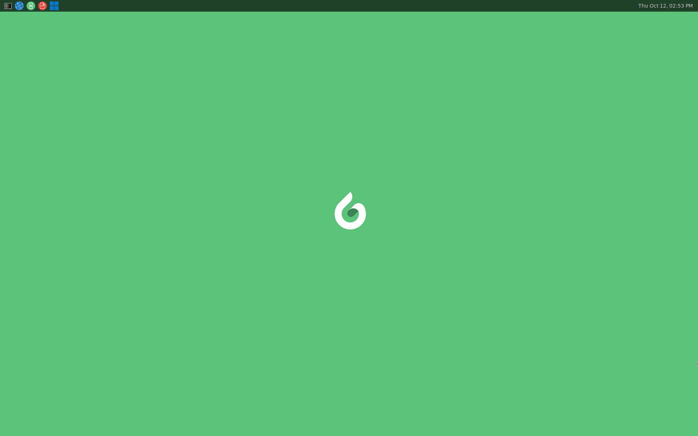

<!--
    Copyright 2023 TII (SSRC) and the Ghaf contributors
    SPDX-License-Identifier: CC-BY-SA-4.0
-->

# Features

The vision for the Ghaf platform is to create a virtualized, scalable reference platform that enables the building of secure products leveraging trusted, reusable, and portable software for edge devices. For more information on reference implementation for several devices, see [Reference Implementations](../ref_impl/reference_implementations.md).

Ghaf demo desktop and applications are illustrated in the screen capture below:

## Status

* &#x2705; - integrated and tested in the `main` branch. No known regression.
* &#x1f6A7; - prototyped or work in progress in the development branch.
* &#x274C; - the feature has known regression or bugs.

### Reference Devices

- `Orin`—NVIDIA Jetson AGX Orin as the main reference device.
- `x86`—generic x86_64; tested on Intel NUC (Next Unit of Computing) or laptop.
- `Lenovo X1`—Lenovo X1 Carbon Gen11 laptop. 
- `aarch64`—generic AArch64; tested on an ARM server, laptop (e.g. Apple M's), or NVIDIA Jetson AGX Orin.
- `All variants`—supported devices from [Architectural Variants](https://tiiuae.github.io/ghaf/architecture/variants.html).

The following tables show the status of Ghaf Platform features:

## Release builds and HW architecture support

| Feature           | Status      | Reference Device | Details                             |
|-------------------|-------------|------------------|-------------------------------------|
| Ghaf in virtual machine | &#x2705; | `x86` | `nix run .#packages.x86_64-linux.vm-debug` |
| `aarch64` reference image | &#x2705; | `Orin`  | Based on [Jetson Linux](https://developer.nvidia.com/embedded/jetson-linux), [OE4T](https://github.com/OE4T) and [jetpack-nixos](https://github.com/anduril/jetpack-nixos). |
| `aarch64` reference image | &#x2705; | `imx8qm`  | Based on NXP BSP, implemented as [nixos-hardware module](https://github.com/NixOS/nixos-hardware/tree/master/nxp)|
| `x86` generic image | &#x2705; | `x86` | Generic x86 computer, based on generic [NixOS](https://nixos.org/). NOTE: requires device specific configuration.|
| `Lenovo X1` reference image | &#x2705; | `Lenovo X1` | x86_64 laptop computer, supports basic compartmentalized environment |
| Native build      | &#x2705;         | `aarch64, x86`   | Remote `aarc64` nixos builders recommended |
| Cross-compilation | &#x1f6A7; | `aarch64, riscv64`  | Depends on NixOS `nixpkgs 23.05` support for cross-compilation |
| CI builds         | &#x2705; | `All`  | [Only `main`-branch, not for all PRs](https://vedenemo.dev/). |
| Emulated build    | &#x274C; | `aarch64`  | `binfmt`, may freeze the build machine. Not recommended. [See instructions.](https://tiiuae.github.io/ghaf/ref_impl/cross_compilation.html#binfmt)|

## Development

| Feature           | Status      | Reference Device | Details                             |
|-------------------|-------------|------------------|----------------------------------------------|
| Quick target update  | &#x2705; | `all`  | `nixos-rebuild --flake .#nvidia-jetson-orin-debug --target-host root@ghaf-host --fast switch` |
| `aarch64` device flashing   | &#x2705;   | `Orin`  | [Full device software flashing using `x86` machine](https://tiiuae.github.io/ghaf/ref_impl/build_and_run.html#flashing-nvidia-jetson-orin-agx) |
| root filesystem flashing | &#x2705;   | `x86, imx8qm`  | `dd` image to bootable media - [see](https://tiiuae.github.io/ghaf/ref_impl/build_and_run.html#running-ghaf-image-for-x86-computer) |
| Debug: SSH        | &#x2705;      | `Orin`, `x86` | Host access only in `-debug`-target, see [authentication.nix](https://github.com/tiiuae/ghaf/blob/main/modules/development/authentication.nix) |
| Debug: Serial     | &#x2705;      | `all` | Host access only in `-debug`-target - e.g. `screen /dev/ttyACM0 115200` |
| Compartmentalized environment     | &#x1f6A7;      | `Lenovo X1` | NetVM, GUI VM (with GPU passthrough) plus some Application VMs |

## Target architecture

| Feature           | Status      | Reference Device | Details                             |
|-------------------|-------------|------------------|----------------------------------------------|
| `minimal host`    | &#x1f6A7;   | [`all`](https://tiiuae.github.io/ghaf/architecture/variants.html) | See [Minimal Host](https://tiiuae.github.io/ghaf/architecture/adr/minimal-host.html) and [PR #140](https://github.com/tiiuae/ghaf/pull/140). |
| `netvm`           |  &#x2705; | `Orin`  | See [netvm](https://tiiuae.github.io/ghaf/architecture/adr/netvm.html). Passthrough with Wifi works but requires SSID/password configuration |
| `idsvm`           |  &#x2705; | `Orin`  | [Defensive security VM placeholder PR open](https://github.com/tiiuae/ghaf/pull/146) |
| `guivm` | &#x1f6A7; | `All`, `Lenovo-X1`| Implemented for Lenovo X1 reference device, other devices have Wayland compositor running on the host.|
| `appvm` | &#x1f6A7; | `All`, `Lenovo-X1`| Implemented for Lenovo X1 reference device: chromium, GALA and zathura VMs. Requires `guivm` in place |
| `adminvm`           | &#x2705; | `All`  | Not started |
| Inter VM comms - IP-based  | &#x1f6A7; | `All` |`-debug`-targets have network bridges to access VMs from host |
| Inter VM comms - shared memory  |  &#x1f6A7; | `All` |  |
| Inter VM Wayland  |  &#x1f6A7; | `All` | Currently it is `waypipe` over SSH, for test and demo purpose only |
| SW update | &#x1f6A7; | `All` | A/B update tooling being evaluated |
| USB passthrough   | &#x1f6A7; | `Orin`  | No reference implementation integrated yet |
| PCI passthrough   | &#x2705; | `All`  | Used for reference in `netvm` on `Orin` |
| UART passthrough  | &#x1f6A7; | `Orin`  | See [NVIDIA Jetson AGX Orin: UART Passthrough](https://tiiuae.github.io/ghaf/build_config/passthrough/nvidia_agx_pt_uart.html). Not integrated to any VM. |
| ARM platform bus devices passthrough  | &#x1f6A7; | `Orin`  | NVIDIA BPMP virtualization being developed |

## Applications and VM control

| Feature           | Status      | Reference Device | Details                             |
|-------------------|-------------|------------------|----------------------------------------------|
| Wayland-compositor | &#x1f6A7; | `Orin`, `x86` | Implemented for `Lenovo-X1` |
| Chromium | &#x1f6A7; | `Orin`, `x86` | Implemented for `Lenovo-X1` |
| Element | &#x1f6A7; | `Orin`, `x86` | On host |
| Cloud Android (CVD) client app (GALA )| &#x1f6A7; | `Orin`, `x86` | Implemented for `Lenovo-X1` |
| Virtualization control | &#x1f6A7; | [`All`](https://tiiuae.github.io/ghaf/architecture/variants.html) | See [vmd design](https://github.com/tiiuae/vmd/blob/main/doc/design.md). |

## Next steps

[See discussion for the outline of next steps](https://github.com/tiiuae/ghaf/issues/150#issuecomment-1564061850)

