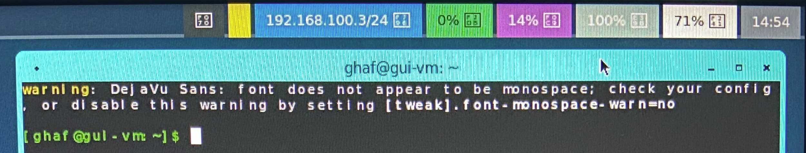

<!--
    Copyright 2022-2024 TII (SSRC) and the Ghaf contributors
    SPDX-License-Identifier: CC-BY-SA-4.0
-->

# labwc Desktop Environment

[labwc](https://labwc.github.io/) is a configurable and lightweight wlroots-based Wayland-compatible desktop environment.


To use labwc as your default desktop environment, add it as a module to Ghaf:

* change the configuration option `profiles.graphics.compositor = "labwc"`
or
* uncomment the corresponding line in the [guivm.nix](https://github.com/tiiuae/ghaf/blob/main/modules/microvm/virtualization/microvm/guivm.nix) file.


The basis of the labwc configuration is the set of following files: `rc.xml`, `menu.xml`, `autostart`, and `environment`. These files can be edited by substituting in the labwc overlay `overlays/custom-packages/labwc/default.nix`.


## Window Border Coloring

The border color concept illustrates the application trustworthiness in a user-friendly manner. The color shows the application's security level and allows avoiding user's mistakes. The same approach can be found in other projects, for example, [QubeOS](https://www.qubes-os.org/doc/getting-started/#color--security).

Ghaf uses patched labwc which makes it possible to change the border color for the chosen application. The implementation is based on window rules by substituting the server decoration colors (`serverDecoration` = `yes`). The `borderColor` property is responsible for the frame color.

> [!IMPORTANT]
> According to the labwc specification, the **identifier** parameter is case-sensitive and relates to app_id for native Wayland windows and WM_CLASS for XWayland clients.

For example, the foot terminal with Aqua colored frame:
```
<windowRules>
  <windowRule identifier="Foot" borderColor="#00FFFF" serverDecoration="yes" skipTaskbar="yes"  />
  <windowRule identifier="firefox" borderColor="#FF0000" serverDecoration="yes" skipTaskbar="yes"  />
</windowRules>
```


