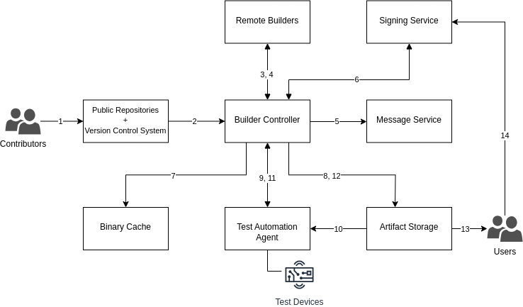

<!--
    Copyright 2022-2024 TII (SSRC) and the Ghaf contributors
    SPDX-License-Identifier: CC-BY-SA-4.0
-->

# Continuous Integration and Distribution

Ghaf Framework uses a CI/CD (Continuous Integration and Continuous Delivery) approach that aims to automate the process of building, testing, and deploying software.

Our goal is to have the ability to deploy code quickly and safely: once a build is deployed, the next build undergoes testing, while the latest build is being coded.

> Currently, Continuous Deployment is not set up.

## General Process

The software delivery pipeline consists of several stages:

1. Contributors make changes in the code and create a pull/merge request to merge changes from one personal fork or branch into the upstream repository/branch.

2. Builder Controller checks source code repositories for changes and fetches them.

3. Builder Controller arranges builds on Remote Builders to make disk images and other release artifacts.

4. After the building is done, Remote Builder sends disk images to Builder Controller to create provenance files and sign disk images and provenance files.

5. On build failure, Builder Controller sends failure notifications to Message Service.

6. Builder Controller uploads all build artifacts to Binary Cache and disk images to Web Server.

7. Test Automation fetches disk images from Binary Cache and runs the hardware test on them.

8. Test Automation uploads test reports to Web Server.

9.  Users can download images from Web Server:

    * release images <https://vedenemo.dev/files/releases/>
    * images for testing <https://vedenemo.dev/files/build_reports/>.
