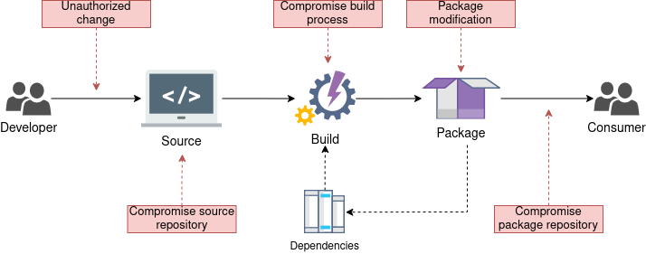

<!--
    Copyright 2022-2023 TII (SSRC) and the Ghaf contributors
    SPDX-License-Identifier: CC-BY-SA-4.0
-->

# Supply Chain Security

To be aware of what is exactly in our software supply chain, it is reviewed for security issues and known vulnerabilities.

We implement a _supply chain security (SCS)_ — process of securing the machinery of the development, building, and release environment. That means that every component that a software artifact might be touching on its way from the developer to the consumer will be secured.

The software artifact should be encrypted on each possible transition phase and its integrity should be verified at each destination. Each build should be accompanied by means of [_software bill of materials (SBOM)_](../appendices/glossary.md#sbom), identifying all the components that the software package consists of.

SBOM containing reference to each dependency, its source and version together with provenance, containing build information are collected at the build time, signed, and used for vulnerability analysis during the next steps.

The software artifact, SBOM, and provenance are signed by the build machinery at the build time, and the signature is verifiable at every destination of the package. The certificates that are used for signing and verification are provided by the _public key infrastructure (PKI)_ system and are signed by the same root _certificate authority (CA)_. That allows you to confirm the author of the signature (build machinery) and guarantees that the package has not been tampered with since the build time.

## In This Chapter

- [SLSA Framework](../scs/slsa-framework.md)
- [Basic Security Measures](../scs/basics.md)
- [SBOM](../scs/sbom.md)
- [Public Key Infrastructure](../scs/pki.md)
- [Security Fix Automation](../scs/ghaf-security-fix-automation.md)