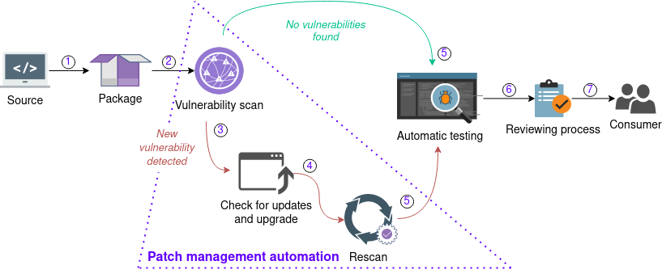

# Patch Management Automation

An automated patch management solution increases complex software development efficiency concurrently ensuring a high level of vulnerability remediation in a reasonable time frame.

The patch management automation (PMA) system processes data in cycles. Every cycle includes a number of stages:
  1. The developer submits the change to the repository. Hydra builds the package from the source.
  2. The Vulnerability Analysis (VA) component scans each software artifact for vulnerabilities immediately after the build.
  3. If new vulnerabilities are discovered, the PMA system scans each dependency provenance for the update availability.
  4. If update availability exists, the PMA system downloads new dependencies, and Hydra builds the new package.
  5. The package is rebuilding with updated dependencies that may affect functionality. The PMA system starts the package regression testing.
  6. A package passing the testing will be presented to the concerned developers for review and approval. The SBOM, scan and test results along with the package are published to a web server. The developer downloads the artifacts for review and approval.
  7. All approved artifacts become release candidates and can be found on the web server.

## Implementation

### Dependency Tracking

The dependency tracking solution is based on Package URL (PURL), natively supported by ClyconeDX. PURL is a URL, composed of seven components:

`scheme:type/namespace/name@version?qualifiers#subpath`

  + **scheme**: URL scheme, with the constant value "pkg", facilitating the future official registration of the "pkg" scheme for package URLs
  + **type**: the package type, such as npm, maven, etc
  + **namespace**: name prefix. For example GitHub user, organization, etc
  + **name**: the name of the package
  + **version**: the version of the package
  + **qualifiers**: extra qualifying data, e.g. OS, distro, architecture, etc
  + **subpath**: extra subpath relative to package root

In addition to PURL, each component should contain at least one hash value, computed from cryptographic hash functions. The hash values help verifying original package integrity and source prior to update download. Thus minimizing security risks during the process.

### Package Update

The update mechanism implementation is system dependent and will differ from build system to another. For example in Nix it is enough that respective nix files are automatically updated and the package is rebuilt. More information on package update steps is available in [NixOSWiki](https://nixos.wiki/wiki/Update_a_package).
